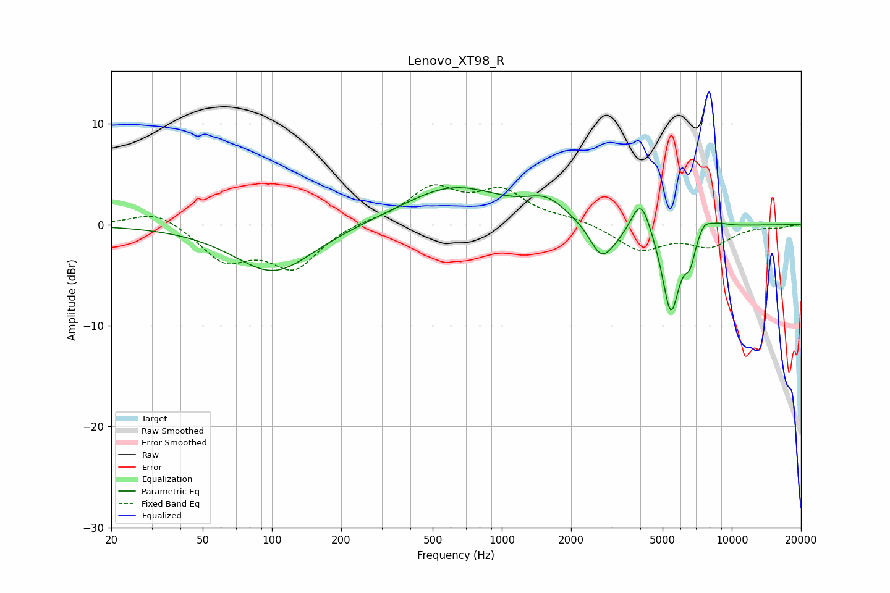

# Lenovo_XT98_R
See [usage instructions](https://github.com/jaakkopasanen/AutoEq#usage) for more options and info.

### Parametric EQs
Apply preamp of -3.8 dB when using parametric equalizer.

|   # | Type    |   Fc (Hz) |    Q |   Gain (dB) |
|-----|---------|-----------|------|-------------|
|   1 | Peaking |       102 | 0.82 |        -4.8 |
|   2 | Peaking |       613 | 0.65 |         3.8 |
|   3 | Peaking |      1567 | 1.64 |         1.9 |
|   4 | Peaking |      2699 | 2.86 |        -2.8 |
|   5 | Peaking |      3076 | 1.87 |        -1.3 |
|   6 | Peaking |      4020 | 3.27 |         3.8 |
|   7 | Peaking |      5432 | 3.53 |        -8.8 |
|   8 | Peaking |      6588 | 6    |        -2.3 |
|   9 | Peaking |      7577 | 4.69 |         1   |
|  10 | Peaking |      8645 | 2.7  |         0.5 |

### Fixed Band EQs
When using fixed band (also called graphic) equalizer, apply preamp of **-4.0 dB** (if available) and set gains manually with these parameters.

|   # | Type    |   Fc (Hz) |    Q |   Gain (dB) |
|-----|---------|-----------|------|-------------|
|   1 | Peaking |        31 | 1.41 |         1.5 |
|   2 | Peaking |        62 | 1.41 |        -3.4 |
|   3 | Peaking |       125 | 1.41 |        -4.1 |
|   4 | Peaking |       250 | 1.41 |         0.3 |
|   5 | Peaking |       500 | 1.41 |         3.5 |
|   6 | Peaking |      1000 | 1.41 |         3   |
|   7 | Peaking |      2000 | 1.41 |         0.5 |
|   8 | Peaking |      4000 | 1.41 |        -2.5 |
|   9 | Peaking |      8000 | 1.41 |        -2   |
|  10 | Peaking |     16000 | 1.41 |        -0.2 |

### Graphs

