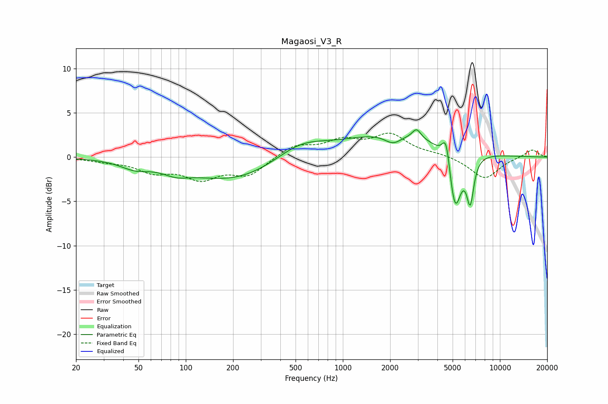

# Magaosi_V3_R
See [usage instructions](https://github.com/jaakkopasanen/AutoEq#usage) for more options and info.

### Parametric EQs
Apply preamp of -3.2 dB when using parametric equalizer.

|   # | Type    |   Fc (Hz) |    Q |   Gain (dB) |
|-----|---------|-----------|------|-------------|
|   1 | Peaking |        47 | 1.54 |        -0.9 |
|   2 | Peaking |        87 | 1.68 |        -0.8 |
|   3 | Peaking |       206 | 0.49 |        -2.7 |
|   4 | Peaking |       533 | 0.85 |         2   |
|   5 | Peaking |      2083 | 2.62 |        -1.1 |
|   6 | Peaking |      2138 | 0.45 |         2.7 |
|   7 | Peaking |      2947 | 5.19 |         1.1 |
|   8 | Peaking |      4547 | 5.78 |         3.3 |
|   9 | Peaking |      5176 | 3.54 |        -6.9 |
|  10 | Peaking |      6473 | 6    |        -4.9 |

### Fixed Band EQs
When using fixed band (also called graphic) equalizer, apply preamp of **-2.8 dB** (if available) and set gains manually with these parameters.

|   # | Type    |   Fc (Hz) |    Q |   Gain (dB) |
|-----|---------|-----------|------|-------------|
|   1 | Peaking |        31 | 1.41 |        -0.4 |
|   2 | Peaking |        62 | 1.41 |        -1.5 |
|   3 | Peaking |       125 | 1.41 |        -2.2 |
|   4 | Peaking |       250 | 1.41 |        -2   |
|   5 | Peaking |       500 | 1.41 |         1.3 |
|   6 | Peaking |      1000 | 1.41 |         1.6 |
|   7 | Peaking |      2000 | 1.41 |         2.4 |
|   8 | Peaking |      4000 | 1.41 |         0.3 |
|   9 | Peaking |      8000 | 1.41 |        -2.5 |
|  10 | Peaking |     16000 | 1.41 |         0.9 |

### Graphs

