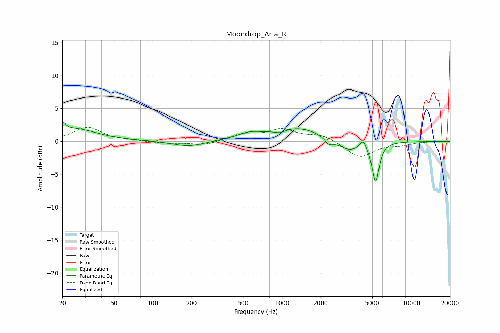

# Moondrop_Aria_R
See [usage instructions](https://github.com/jaakkopasanen/AutoEq#usage) for more options and info.

### Parametric EQs
Apply preamp of -3.0 dB when using parametric equalizer.

|   # | Type    |   Fc (Hz) |    Q |   Gain (dB) |
|-----|---------|-----------|------|-------------|
|   1 | Peaking |        20 | 5.92 |         1.3 |
|   2 | Peaking |        25 | 0.83 |         1.9 |
|   3 | Peaking |       189 | 1.23 |        -0.8 |
|   4 | Peaking |       558 | 1.5  |         0.9 |
|   5 | Peaking |       971 | 3.34 |        -0.5 |
|   6 | Peaking |      1334 | 0.71 |         2.1 |
|   7 | Peaking |      2307 | 4.12 |        -1   |
|   8 | Peaking |      3314 | 1.64 |        -1.7 |
|   9 | Peaking |      4244 | 5.82 |         1.4 |
|  10 | Peaking |      5307 | 5.13 |        -6   |

### Fixed Band EQs
When using fixed band (also called graphic) equalizer, apply preamp of **-2.2 dB** (if available) and set gains manually with these parameters.

|   # | Type    |   Fc (Hz) |    Q |   Gain (dB) |
|-----|---------|-----------|------|-------------|
|   1 | Peaking |        31 | 1.41 |         2.1 |
|   2 | Peaking |        62 | 1.41 |         0.1 |
|   3 | Peaking |       125 | 1.41 |        -0.3 |
|   4 | Peaking |       250 | 1.41 |        -0.6 |
|   5 | Peaking |       500 | 1.41 |         1   |
|   6 | Peaking |      1000 | 1.41 |         1.7 |
|   7 | Peaking |      2000 | 1.41 |         1   |
|   8 | Peaking |      4000 | 1.41 |        -2.4 |
|   9 | Peaking |      8000 | 1.41 |        -0.5 |
|  10 | Peaking |     16000 | 1.41 |         0   |

### Graphs

