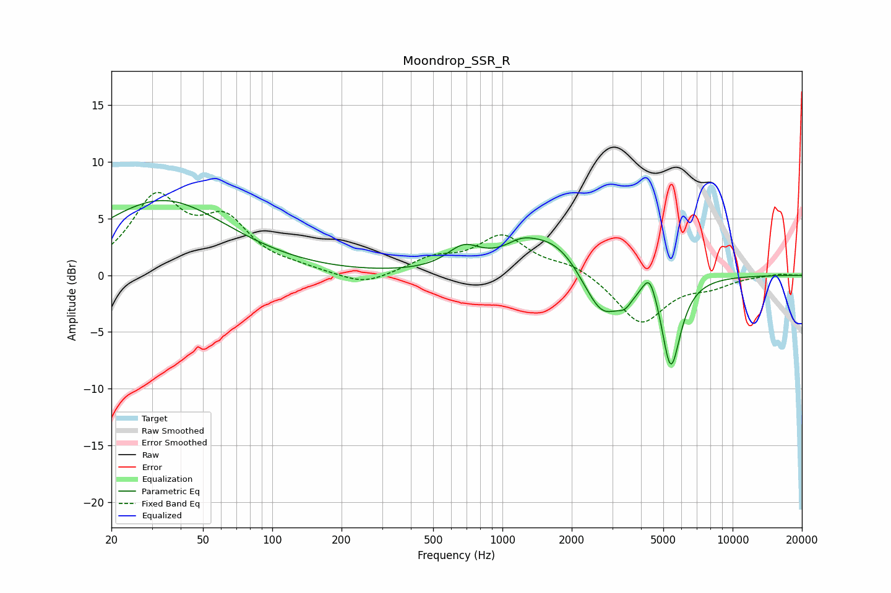

# Moondrop_SSR_R
See [usage instructions](https://github.com/jaakkopasanen/AutoEq#usage) for more options and info.

### Parametric EQs
Apply preamp of -6.7 dB when using parametric equalizer.

|   # | Type    |   Fc (Hz) |    Q |   Gain (dB) |
|-----|---------|-----------|------|-------------|
|   1 | Peaking |        33 | 0.5  |         6.6 |
|   2 | Peaking |       677 | 1.97 |         1.8 |
|   3 | Peaking |      1195 | 2.32 |         0.8 |
|   4 | Peaking |      1648 | 0.9  |         3.5 |
|   5 | Peaking |      2299 | 2.17 |        -0.4 |
|   6 | Peaking |      2725 | 1.76 |        -4.2 |
|   7 | Peaking |      3408 | 4.24 |        -1.1 |
|   8 | Peaking |      4358 | 4.71 |         2.2 |
|   9 | Peaking |      4849 | 4.35 |         0.6 |
|  10 | Peaking |      5380 | 3.25 |        -8.4 |

### Fixed Band EQs
When using fixed band (also called graphic) equalizer, apply preamp of **-7.4 dB** (if available) and set gains manually with these parameters.

|   # | Type    |   Fc (Hz) |    Q |   Gain (dB) |
|-----|---------|-----------|------|-------------|
|   1 | Peaking |        31 | 1.41 |         6.5 |
|   2 | Peaking |        62 | 1.41 |         4.3 |
|   3 | Peaking |       125 | 1.41 |         0.4 |
|   4 | Peaking |       250 | 1.41 |        -1   |
|   5 | Peaking |       500 | 1.41 |         1.3 |
|   6 | Peaking |      1000 | 1.41 |         3.3 |
|   7 | Peaking |      2000 | 1.41 |         0.9 |
|   8 | Peaking |      4000 | 1.41 |        -4.3 |
|   9 | Peaking |      8000 | 1.41 |        -0.8 |
|  10 | Peaking |     16000 | 1.41 |         0.2 |

### Graphs

