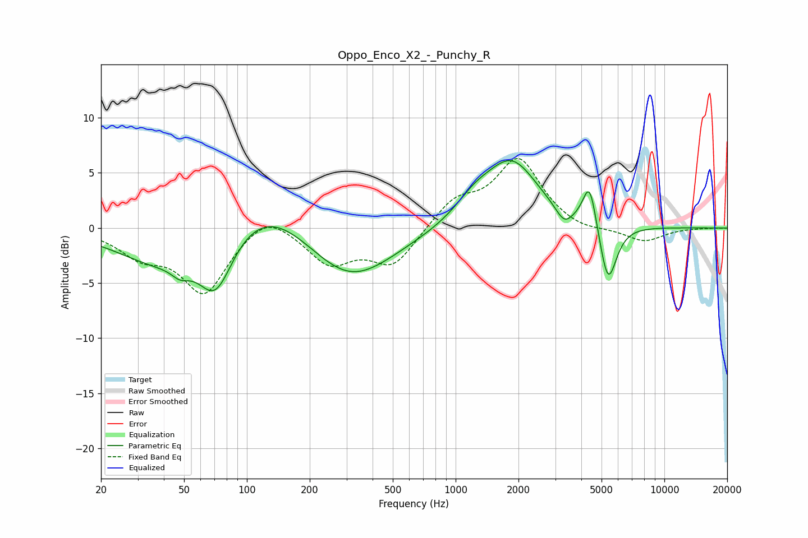

# Oppo_Enco_X2_-_Punchy_R
See [usage instructions](https://github.com/jaakkopasanen/AutoEq#usage) for more options and info.

### Parametric EQs
Apply preamp of -6.2 dB when using parametric equalizer.

|   # | Type    |   Fc (Hz) |    Q |   Gain (dB) |
|-----|---------|-----------|------|-------------|
|   1 | Peaking |        38 | 0.68 |        -3.1 |
|   2 | Peaking |        48 | 3.41 |        -0.9 |
|   3 | Peaking |        71 | 1.69 |        -5.4 |
|   4 | Peaking |       122 | 0.66 |         3.5 |
|   5 | Peaking |       309 | 0.67 |        -5.1 |
|   6 | Peaking |      1230 | 1.52 |         1.6 |
|   7 | Peaking |      1860 | 1.1  |         5.9 |
|   8 | Peaking |      3312 | 3.53 |        -1.4 |
|   9 | Peaking |      4384 | 4.29 |         4.2 |
|  10 | Peaking |      5370 | 3.39 |        -5.6 |

### Fixed Band EQs
When using fixed band (also called graphic) equalizer, apply preamp of **-6.4 dB** (if available) and set gains manually with these parameters.

|   # | Type    |   Fc (Hz) |    Q |   Gain (dB) |
|-----|---------|-----------|------|-------------|
|   1 | Peaking |        31 | 1.41 |        -2.2 |
|   2 | Peaking |        62 | 1.41 |        -5.8 |
|   3 | Peaking |       125 | 1.41 |         1.9 |
|   4 | Peaking |       250 | 1.41 |        -3.1 |
|   5 | Peaking |       500 | 1.41 |        -3.3 |
|   6 | Peaking |      1000 | 1.41 |         2.4 |
|   7 | Peaking |      2000 | 1.41 |         6.1 |
|   8 | Peaking |      4000 | 1.41 |        -0.5 |
|   9 | Peaking |      8000 | 1.41 |        -1.3 |
|  10 | Peaking |     16000 | 1.41 |         0   |

### Graphs

