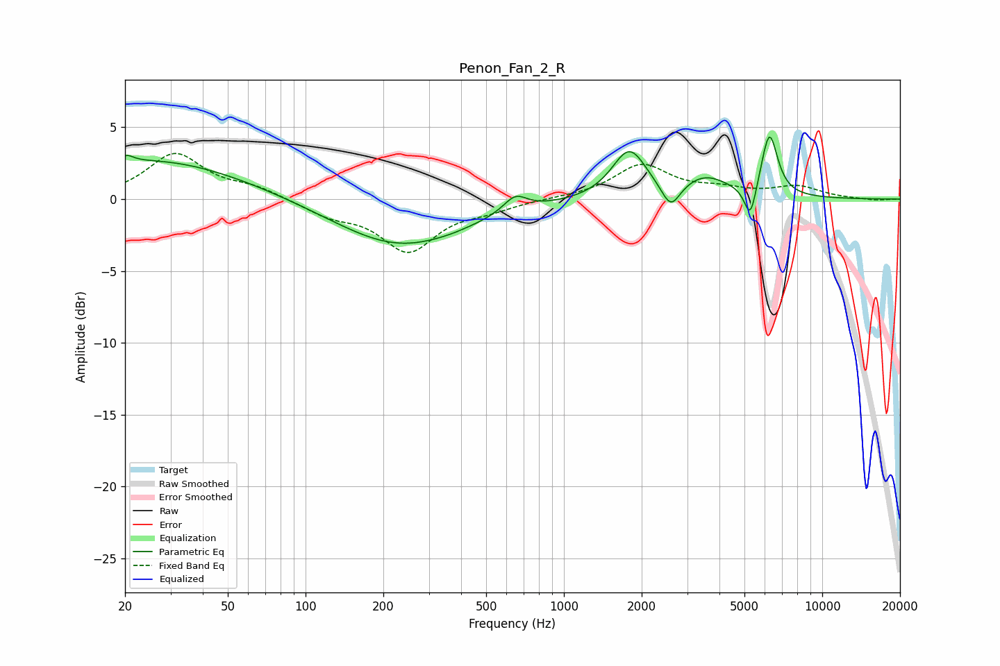

# Penon_Fan_2_R
See [usage instructions](https://github.com/jaakkopasanen/AutoEq#usage) for more options and info.

### Parametric EQs
Apply preamp of -4.4 dB when using parametric equalizer.

|   # | Type    |   Fc (Hz) |    Q |   Gain (dB) |
|-----|---------|-----------|------|-------------|
|   1 | Peaking |        20 | 5.64 |         0.5 |
|   2 | Peaking |        25 | 0.39 |         2.8 |
|   3 | Peaking |       233 | 0.56 |        -3.3 |
|   4 | Peaking |       367 | 2.28 |        -0.1 |
|   5 | Peaking |       648 | 3.09 |         1.2 |
|   6 | Peaking |      1791 | 2.14 |         3.4 |
|   7 | Peaking |      2593 | 3.95 |        -1.8 |
|   8 | Peaking |      3527 | 1.54 |         1.4 |
|   9 | Peaking |      5270 | 6    |        -2.5 |
|  10 | Peaking |      6246 | 4.38 |         4.4 |

### Fixed Band EQs
When using fixed band (also called graphic) equalizer, apply preamp of **-3.3 dB** (if available) and set gains manually with these parameters.

|   # | Type    |   Fc (Hz) |    Q |   Gain (dB) |
|-----|---------|-----------|------|-------------|
|   1 | Peaking |        31 | 1.41 |         3.1 |
|   2 | Peaking |        62 | 1.41 |         0.7 |
|   3 | Peaking |       125 | 1.41 |        -1   |
|   4 | Peaking |       250 | 1.41 |        -3.5 |
|   5 | Peaking |       500 | 1.41 |        -0.6 |
|   6 | Peaking |      1000 | 1.41 |         0.1 |
|   7 | Peaking |      2000 | 1.41 |         2.3 |
|   8 | Peaking |      4000 | 1.41 |         0.6 |
|   9 | Peaking |      8000 | 1.41 |         0.8 |
|  10 | Peaking |     16000 | 1.41 |        -0.1 |

### Graphs

