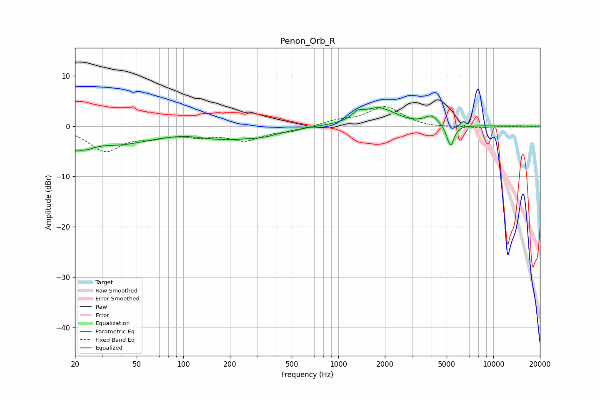

# Penon_Orb_R
See [usage instructions](https://github.com/jaakkopasanen/AutoEq#usage) for more options and info.

### Parametric EQs
Apply preamp of -3.8 dB when using parametric equalizer.

|   # | Type    |   Fc (Hz) |    Q |   Gain (dB) |
|-----|---------|-----------|------|-------------|
|   1 | Peaking |        20 | 4.96 |        -1.8 |
|   2 | Peaking |        23 | 2.44 |        -1.8 |
|   3 | Peaking |        38 | 0.65 |        -3.3 |
|   4 | Peaking |       105 | 1.73 |         0.2 |
|   5 | Peaking |       188 | 0.67 |        -2.2 |
|   6 | Peaking |       336 | 1.3  |        -0.8 |
|   7 | Peaking |      1330 | 4.34 |         1.2 |
|   8 | Peaking |      1818 | 1.3  |         3.6 |
|   9 | Peaking |      3992 | 3.32 |         1.7 |
|  10 | Peaking |      5290 | 5.94 |        -4.4 |

### Fixed Band EQs
When using fixed band (also called graphic) equalizer, apply preamp of **-4.0 dB** (if available) and set gains manually with these parameters.

|   # | Type    |   Fc (Hz) |    Q |   Gain (dB) |
|-----|---------|-----------|------|-------------|
|   1 | Peaking |        31 | 1.41 |        -4.7 |
|   2 | Peaking |        62 | 1.41 |        -1.6 |
|   3 | Peaking |       125 | 1.41 |        -1.5 |
|   4 | Peaking |       250 | 1.41 |        -2.6 |
|   5 | Peaking |       500 | 1.41 |        -0.8 |
|   6 | Peaking |      1000 | 1.41 |         1   |
|   7 | Peaking |      2000 | 1.41 |         3.8 |
|   8 | Peaking |      4000 | 1.41 |        -0.4 |
|   9 | Peaking |      8000 | 1.41 |        -0.3 |
|  10 | Peaking |     16000 | 1.41 |        -0.2 |

### Graphs

