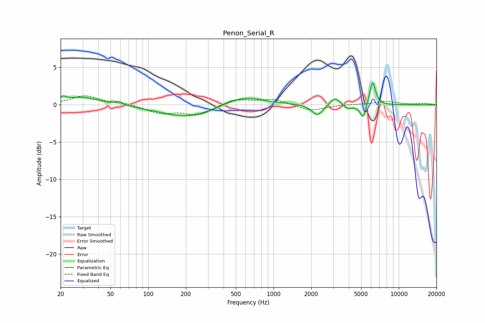

# Penon_Serial_R
See [usage instructions](https://github.com/jaakkopasanen/AutoEq#usage) for more options and info.

### Parametric EQs
Apply preamp of -3.0 dB when using parametric equalizer.

|   # | Type    |   Fc (Hz) |    Q |   Gain (dB) |
|-----|---------|-----------|------|-------------|
|   1 | Peaking |        21 | 5.97 |         0.6 |
|   2 | Peaking |        30 | 1.07 |         1.1 |
|   3 | Peaking |        58 | 5.63 |         0.5 |
|   4 | Peaking |       213 | 0.61 |        -1.8 |
|   5 | Peaking |       555 | 0.84 |         1.4 |
|   6 | Peaking |      2236 | 3.3  |        -1.5 |
|   7 | Peaking |      3103 | 3.98 |         1.1 |
|   8 | Peaking |      3965 | 3.61 |        -0.6 |
|   9 | Peaking |      5191 | 5.98 |        -1.9 |
|  10 | Peaking |      6174 | 5.89 |         3.3 |

### Fixed Band EQs
When using fixed band (also called graphic) equalizer, apply preamp of **-1.3 dB** (if available) and set gains manually with these parameters.

|   # | Type    |   Fc (Hz) |    Q |   Gain (dB) |
|-----|---------|-----------|------|-------------|
|   1 | Peaking |        31 | 1.41 |         1.2 |
|   2 | Peaking |        62 | 1.41 |         0.2 |
|   3 | Peaking |       125 | 1.41 |        -1.1 |
|   4 | Peaking |       250 | 1.41 |        -1.3 |
|   5 | Peaking |       500 | 1.41 |         0.8 |
|   6 | Peaking |      1000 | 1.41 |         0.7 |
|   7 | Peaking |      2000 | 1.41 |        -0.8 |
|   8 | Peaking |      4000 | 1.41 |         0.1 |
|   9 | Peaking |      8000 | 1.41 |         0.4 |
|  10 | Peaking |     16000 | 1.41 |         0.2 |

### Graphs

