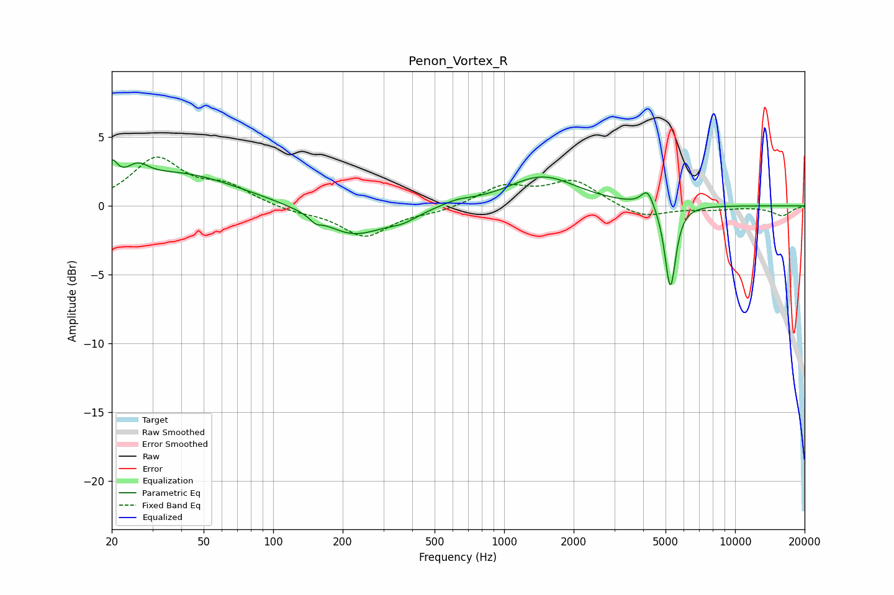

# Penon_Vortex_R
See [usage instructions](https://github.com/jaakkopasanen/AutoEq#usage) for more options and info.

### Parametric EQs
Apply preamp of -3.4 dB when using parametric equalizer.

|   # | Type    |   Fc (Hz) |    Q |   Gain (dB) |
|-----|---------|-----------|------|-------------|
|   1 | Peaking |        20 | 5.88 |         1.6 |
|   2 | Peaking |        26 | 3.09 |         1.1 |
|   3 | Peaking |        39 | 0.55 |         2.3 |
|   4 | Peaking |       153 | 5.96 |        -0.4 |
|   5 | Peaking |       221 | 1.01 |        -2.2 |
|   6 | Peaking |       365 | 2.13 |        -0.5 |
|   7 | Peaking |       622 | 2.2  |         0.3 |
|   8 | Peaking |      1463 | 0.95 |         2.1 |
|   9 | Peaking |      4178 | 5.3  |         1.3 |
|  10 | Peaking |      5245 | 6    |        -6.2 |

### Fixed Band EQs
When using fixed band (also called graphic) equalizer, apply preamp of **-3.6 dB** (if available) and set gains manually with these parameters.

|   # | Type    |   Fc (Hz) |    Q |   Gain (dB) |
|-----|---------|-----------|------|-------------|
|   1 | Peaking |        31 | 1.41 |         3.3 |
|   2 | Peaking |        62 | 1.41 |         1.3 |
|   3 | Peaking |       125 | 1.41 |        -0.4 |
|   4 | Peaking |       250 | 1.41 |        -2.2 |
|   5 | Peaking |       500 | 1.41 |        -0.4 |
|   6 | Peaking |      1000 | 1.41 |         1.4 |
|   7 | Peaking |      2000 | 1.41 |         1.8 |
|   8 | Peaking |      4000 | 1.41 |        -0.9 |
|   9 | Peaking |      8000 | 1.41 |        -0.2 |
|  10 | Peaking |     16000 | 1.41 |        -0.7 |

### Graphs

