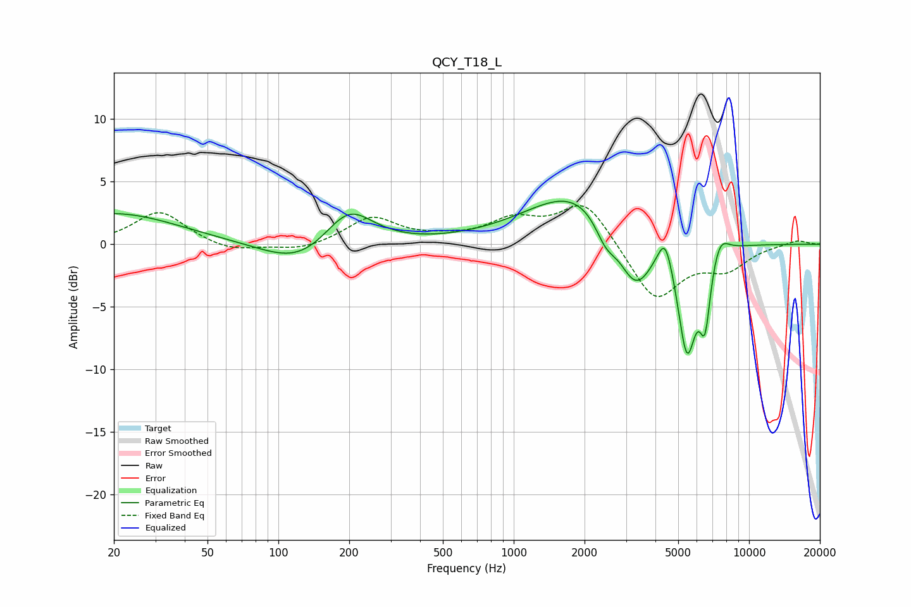

# QCY_T18_L
See [usage instructions](https://github.com/jaakkopasanen/AutoEq#usage) for more options and info.

### Parametric EQs
Apply preamp of -3.5 dB when using parametric equalizer.

|   # | Type    |   Fc (Hz) |    Q |   Gain (dB) |
|-----|---------|-----------|------|-------------|
|   1 | Peaking |        20 | 0.52 |         2.5 |
|   2 | Peaking |       124 | 0.91 |        -2   |
|   3 | Peaking |       199 | 1.35 |         3.2 |
|   4 | Peaking |      1887 | 0.66 |         4.4 |
|   5 | Peaking |      2457 | 3.09 |        -1.9 |
|   6 | Peaking |      3286 | 1.87 |        -4.9 |
|   7 | Peaking |      4403 | 4.31 |         2.8 |
|   8 | Peaking |      5449 | 3.43 |        -8.8 |
|   9 | Peaking |      6501 | 5.99 |        -5   |
|  10 | Peaking |      7517 | 3.74 |         1.6 |

### Fixed Band EQs
When using fixed band (also called graphic) equalizer, apply preamp of **-3.2 dB** (if available) and set gains manually with these parameters.

|   # | Type    |   Fc (Hz) |    Q |   Gain (dB) |
|-----|---------|-----------|------|-------------|
|   1 | Peaking |        31 | 1.41 |         2.6 |
|   2 | Peaking |        62 | 1.41 |        -0.7 |
|   3 | Peaking |       125 | 1.41 |        -0.6 |
|   4 | Peaking |       250 | 1.41 |         2.1 |
|   5 | Peaking |       500 | 1.41 |         0.3 |
|   6 | Peaking |      1000 | 1.41 |         1.8 |
|   7 | Peaking |      2000 | 1.41 |         3.5 |
|   8 | Peaking |      4000 | 1.41 |        -4.6 |
|   9 | Peaking |      8000 | 1.41 |        -1.8 |
|  10 | Peaking |     16000 | 1.41 |         0.4 |

### Graphs

