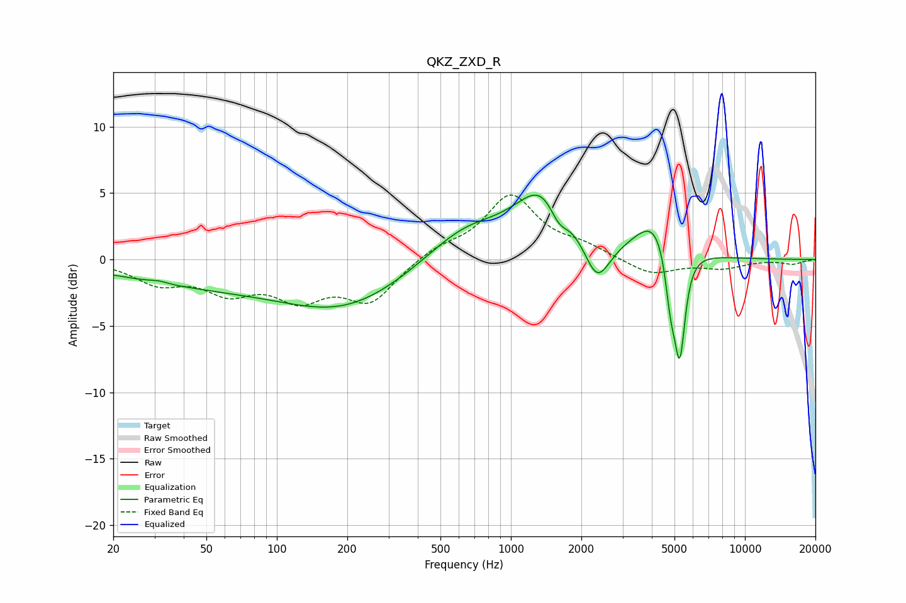

# QKZ_ZXD_R
See [usage instructions](https://github.com/jaakkopasanen/AutoEq#usage) for more options and info.

### Parametric EQs
Apply preamp of -4.9 dB when using parametric equalizer.

|   # | Type    |   Fc (Hz) |    Q |   Gain (dB) |
|-----|---------|-----------|------|-------------|
|   1 | Peaking |        31 | 3.93 |         0.2 |
|   2 | Peaking |        48 | 0.38 |        -1.7 |
|   3 | Peaking |       197 | 0.53 |        -3.3 |
|   4 | Peaking |       637 | 0.84 |         2.4 |
|   5 | Peaking |      1403 | 1.15 |         5.2 |
|   6 | Peaking |      1598 | 3.28 |        -1.8 |
|   7 | Peaking |      2331 | 2.53 |        -3.4 |
|   8 | Peaking |      4156 | 1.68 |         3   |
|   9 | Peaking |      4810 | 6    |        -3.8 |
|  10 | Peaking |      5268 | 5.96 |        -7.8 |

### Fixed Band EQs
When using fixed band (also called graphic) equalizer, apply preamp of **-5.0 dB** (if available) and set gains manually with these parameters.

|   # | Type    |   Fc (Hz) |    Q |   Gain (dB) |
|-----|---------|-----------|------|-------------|
|   1 | Peaking |        31 | 1.41 |        -1.6 |
|   2 | Peaking |        62 | 1.41 |        -2.1 |
|   3 | Peaking |       125 | 1.41 |        -2.6 |
|   4 | Peaking |       250 | 1.41 |        -3   |
|   5 | Peaking |       500 | 1.41 |         0.8 |
|   6 | Peaking |      1000 | 1.41 |         4.7 |
|   7 | Peaking |      2000 | 1.41 |         0.8 |
|   8 | Peaking |      4000 | 1.41 |        -1.2 |
|   9 | Peaking |      8000 | 1.41 |        -0.6 |
|  10 | Peaking |     16000 | 1.41 |        -0.3 |

### Graphs

