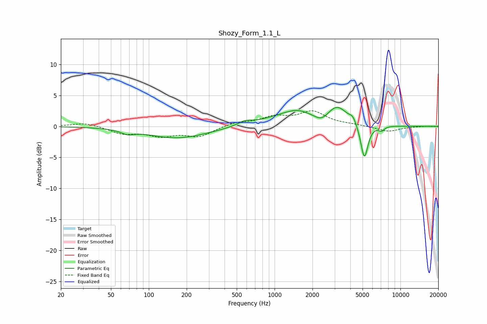

# Shozy_Form_1.1_L
See [usage instructions](https://github.com/jaakkopasanen/AutoEq#usage) for more options and info.

### Parametric EQs
Apply preamp of -3.2 dB when using parametric equalizer.

|   # | Type    |   Fc (Hz) |    Q |   Gain (dB) |
|-----|---------|-----------|------|-------------|
|   1 | Peaking |        68 | 2.87 |        -0.6 |
|   2 | Peaking |       170 | 0.59 |        -1.9 |
|   3 | Peaking |       581 | 2.53 |         0.6 |
|   4 | Peaking |      1462 | 0.71 |         2.3 |
|   5 | Peaking |      1502 | 2.39 |         0.3 |
|   6 | Peaking |      2370 | 2.3  |        -1.4 |
|   7 | Peaking |      3134 | 1.75 |         2.8 |
|   8 | Peaking |      4186 | 5.44 |         0.9 |
|   9 | Peaking |      5167 | 4.78 |        -5.7 |
|  10 | Peaking |      7073 | 6    |        -0.7 |

### Fixed Band EQs
When using fixed band (also called graphic) equalizer, apply preamp of **-2.6 dB** (if available) and set gains manually with these parameters.

|   # | Type    |   Fc (Hz) |    Q |   Gain (dB) |
|-----|---------|-----------|------|-------------|
|   1 | Peaking |        31 | 1.41 |         0.6 |
|   2 | Peaking |        62 | 1.41 |        -1.1 |
|   3 | Peaking |       125 | 1.41 |        -1.4 |
|   4 | Peaking |       250 | 1.41 |        -1.5 |
|   5 | Peaking |       500 | 1.41 |         0.6 |
|   6 | Peaking |      1000 | 1.41 |         1.4 |
|   7 | Peaking |      2000 | 1.41 |         2.3 |
|   8 | Peaking |      4000 | 1.41 |         0.2 |
|   9 | Peaking |      8000 | 1.41 |        -0.8 |
|  10 | Peaking |     16000 | 1.41 |         0.1 |

### Graphs

