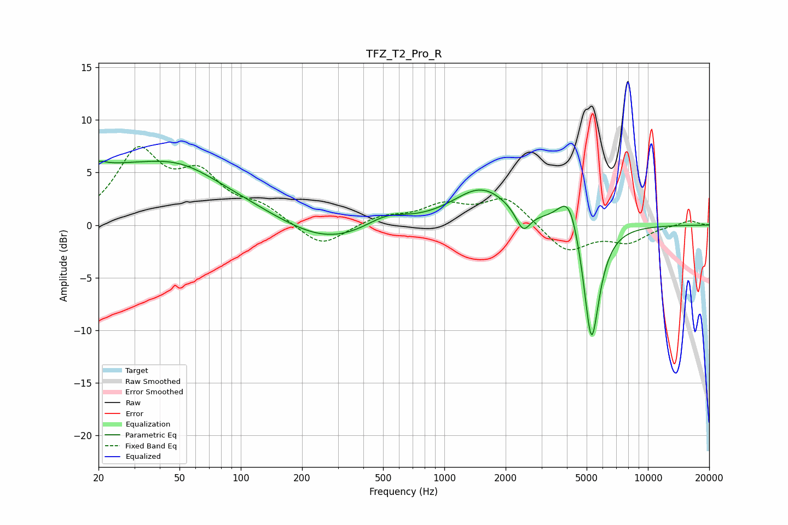

# TFZ_T2_Pro_R
See [usage instructions](https://github.com/jaakkopasanen/AutoEq#usage) for more options and info.

### Parametric EQs
Apply preamp of -6.2 dB when using parametric equalizer.

|   # | Type    |   Fc (Hz) |    Q |   Gain (dB) |
|-----|---------|-----------|------|-------------|
|   1 | Peaking |        20 | 5.98 |        -2.9 |
|   2 | Peaking |        20 | 5.84 |         3.3 |
|   3 | Peaking |        21 | 0.21 |         5.4 |
|   4 | Peaking |        51 | 0.85 |         1.3 |
|   5 | Peaking |       262 | 0.65 |        -2   |
|   6 | Peaking |       518 | 1.38 |         1.2 |
|   7 | Peaking |      1523 | 1    |         3.5 |
|   8 | Peaking |      2436 | 4.02 |        -2.1 |
|   9 | Peaking |      4117 | 2.57 |         4   |
|  10 | Peaking |      5278 | 3.41 |       -12.1 |

### Fixed Band EQs
When using fixed band (also called graphic) equalizer, apply preamp of **-7.6 dB** (if available) and set gains manually with these parameters.

|   # | Type    |   Fc (Hz) |    Q |   Gain (dB) |
|-----|---------|-----------|------|-------------|
|   1 | Peaking |        31 | 1.41 |         6.6 |
|   2 | Peaking |        62 | 1.41 |         4.1 |
|   3 | Peaking |       125 | 1.41 |         1.5 |
|   4 | Peaking |       250 | 1.41 |        -2.2 |
|   5 | Peaking |       500 | 1.41 |         0.8 |
|   6 | Peaking |      1000 | 1.41 |         1.7 |
|   7 | Peaking |      2000 | 1.41 |         2.6 |
|   8 | Peaking |      4000 | 1.41 |        -2.6 |
|   9 | Peaking |      8000 | 1.41 |        -1.5 |
|  10 | Peaking |     16000 | 1.41 |         0.5 |

### Graphs

