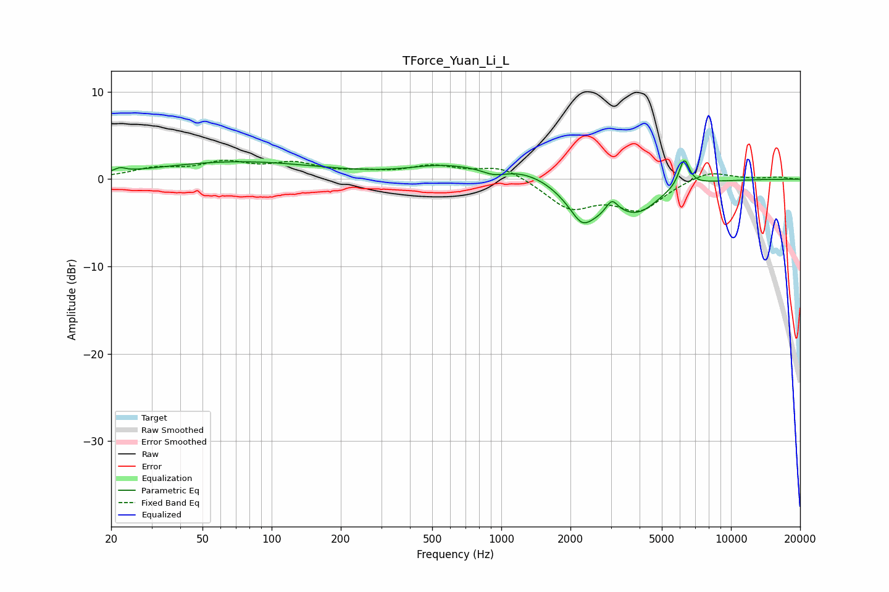

# TForce_Yuan_Li_L
See [usage instructions](https://github.com/jaakkopasanen/AutoEq#usage) for more options and info.

### Parametric EQs
Apply preamp of -2.2 dB when using parametric equalizer.

|   # | Type    |   Fc (Hz) |    Q |   Gain (dB) |
|-----|---------|-----------|------|-------------|
|   1 | Peaking |        22 | 5.95 |         0.5 |
|   2 | Peaking |        71 | 0.39 |         2   |
|   3 | Peaking |       528 | 1.05 |         0.8 |
|   4 | Peaking |       933 | 2.48 |        -0.9 |
|   5 | Peaking |      1470 | 0.52 |         2.3 |
|   6 | Peaking |      2239 | 3.53 |        -1.4 |
|   7 | Peaking |      2349 | 1.15 |        -5   |
|   8 | Peaking |      3030 | 5.46 |         1.6 |
|   9 | Peaking |      3977 | 1.49 |        -3   |
|  10 | Peaking |      6255 | 5.99 |         3.2 |

### Fixed Band EQs
When using fixed band (also called graphic) equalizer, apply preamp of **-2.3 dB** (if available) and set gains manually with these parameters.

|   # | Type    |   Fc (Hz) |    Q |   Gain (dB) |
|-----|---------|-----------|------|-------------|
|   1 | Peaking |        31 | 1.41 |         1.1 |
|   2 | Peaking |        62 | 1.41 |         1.7 |
|   3 | Peaking |       125 | 1.41 |         1.5 |
|   4 | Peaking |       250 | 1.41 |         0.5 |
|   5 | Peaking |       500 | 1.41 |         1.3 |
|   6 | Peaking |      1000 | 1.41 |         1.5 |
|   7 | Peaking |      2000 | 1.41 |        -3.2 |
|   8 | Peaking |      4000 | 1.41 |        -3.3 |
|   9 | Peaking |      8000 | 1.41 |         1.1 |
|  10 | Peaking |     16000 | 1.41 |         0.2 |

### Graphs

