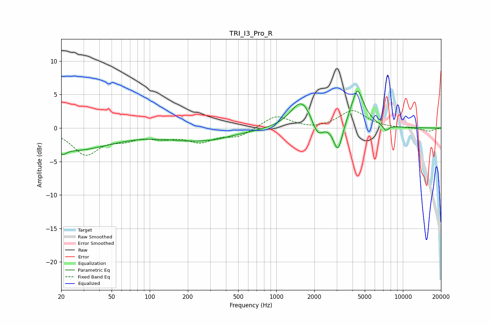

# TRI_I3_Pro_R
See [usage instructions](https://github.com/jaakkopasanen/AutoEq#usage) for more options and info.

### Parametric EQs
Apply preamp of -5.6 dB when using parametric equalizer.

|   # | Type    |   Fc (Hz) |    Q |   Gain (dB) |
|-----|---------|-----------|------|-------------|
|   1 | Peaking |        21 | 5.52 |        -0.7 |
|   2 | Peaking |        24 | 0.44 |        -3.2 |
|   3 | Peaking |       243 | 0.52 |        -1.8 |
|   4 | Peaking |       338 | 3.2  |        -0.1 |
|   5 | Peaking |      1585 | 1.69 |         4.3 |
|   6 | Peaking |      2118 | 3.21 |        -2.5 |
|   7 | Peaking |      3072 | 3.91 |        -4.4 |
|   8 | Peaking |      4369 | 5.55 |         1   |
|   9 | Peaking |      4377 | 2.34 |         4.9 |
|  10 | Peaking |      7334 | 6    |        -0.9 |

### Fixed Band EQs
When using fixed band (also called graphic) equalizer, apply preamp of **-2.7 dB** (if available) and set gains manually with these parameters.

|   # | Type    |   Fc (Hz) |    Q |   Gain (dB) |
|-----|---------|-----------|------|-------------|
|   1 | Peaking |        31 | 1.41 |        -3.8 |
|   2 | Peaking |        62 | 1.41 |        -1.3 |
|   3 | Peaking |       125 | 1.41 |        -1.2 |
|   4 | Peaking |       250 | 1.41 |        -1.8 |
|   5 | Peaking |       500 | 1.41 |        -1.2 |
|   6 | Peaking |      1000 | 1.41 |         1.9 |
|   7 | Peaking |      2000 | 1.41 |        -0.3 |
|   8 | Peaking |      4000 | 1.41 |         2.6 |
|   9 | Peaking |      8000 | 1.41 |        -0   |
|  10 | Peaking |     16000 | 1.41 |        -0.5 |

### Graphs

