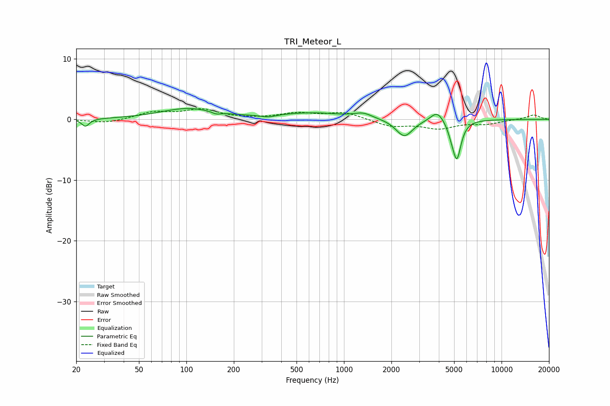

# TRI_Meteor_L
See [usage instructions](https://github.com/jaakkopasanen/AutoEq#usage) for more options and info.

### Parametric EQs
Apply preamp of -1.9 dB when using parametric equalizer.

|   # | Type    |   Fc (Hz) |    Q |   Gain (dB) |
|-----|---------|-----------|------|-------------|
|   1 | Peaking |        23 | 5.93 |        -1.3 |
|   2 | Peaking |       102 | 0.81 |         1.8 |
|   3 | Peaking |       155 | 5.14 |        -0.4 |
|   4 | Peaking |       331 | 3.18 |        -0.4 |
|   5 | Peaking |       626 | 0.68 |         1   |
|   6 | Peaking |      1326 | 2.54 |         0.8 |
|   7 | Peaking |      2415 | 2.66 |        -2.9 |
|   8 | Peaking |      3906 | 3.4  |         1.8 |
|   9 | Peaking |      4808 | 6    |        -1.1 |
|  10 | Peaking |      5204 | 5.24 |        -6.2 |

### Fixed Band EQs
When using fixed band (also called graphic) equalizer, apply preamp of **-1.8 dB** (if available) and set gains manually with these parameters.

|   # | Type    |   Fc (Hz) |    Q |   Gain (dB) |
|-----|---------|-----------|------|-------------|
|   1 | Peaking |        31 | 1.41 |        -0.6 |
|   2 | Peaking |        62 | 1.41 |         1.1 |
|   3 | Peaking |       125 | 1.41 |         1.5 |
|   4 | Peaking |       250 | 1.41 |         0   |
|   5 | Peaking |       500 | 1.41 |         0.9 |
|   6 | Peaking |      1000 | 1.41 |         1.1 |
|   7 | Peaking |      2000 | 1.41 |        -1.1 |
|   8 | Peaking |      4000 | 1.41 |        -1.4 |
|   9 | Peaking |      8000 | 1.41 |        -0.7 |
|  10 | Peaking |     16000 | 1.41 |         0.8 |

### Graphs

