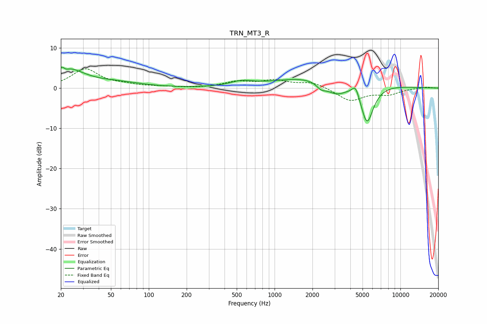

# TRN_MT3_R
See [usage instructions](https://github.com/jaakkopasanen/AutoEq#usage) for more options and info.

### Parametric EQs
Apply preamp of -5.3 dB when using parametric equalizer.

|   # | Type    |   Fc (Hz) |    Q |   Gain (dB) |
|-----|---------|-----------|------|-------------|
|   1 | Peaking |        21 | 5.89 |         2.7 |
|   2 | Peaking |        21 | 5.84 |        -2.6 |
|   3 | Peaking |        22 | 1.02 |         4.6 |
|   4 | Peaking |        57 | 0.74 |         1.1 |
|   5 | Peaking |       547 | 1.62 |         1.2 |
|   6 | Peaking |      2342 | 3.74 |        -1.4 |
|   7 | Peaking |      2630 | 0.39 |         3.4 |
|   8 | Peaking |      3079 | 1.57 |        -3.7 |
|   9 | Peaking |      4404 | 4.98 |         2.8 |
|  10 | Peaking |      5426 | 2.58 |       -10.3 |

### Fixed Band EQs
When using fixed band (also called graphic) equalizer, apply preamp of **-4.9 dB** (if available) and set gains manually with these parameters.

|   # | Type    |   Fc (Hz) |    Q |   Gain (dB) |
|-----|---------|-----------|------|-------------|
|   1 | Peaking |        31 | 1.41 |         4.6 |
|   2 | Peaking |        62 | 1.41 |         0.6 |
|   3 | Peaking |       125 | 1.41 |         0.3 |
|   4 | Peaking |       250 | 1.41 |        -0.1 |
|   5 | Peaking |       500 | 1.41 |         1.4 |
|   6 | Peaking |      1000 | 1.41 |         1.7 |
|   7 | Peaking |      2000 | 1.41 |         1.4 |
|   8 | Peaking |      4000 | 1.41 |        -3.2 |
|   9 | Peaking |      8000 | 1.41 |        -1.4 |
|  10 | Peaking |     16000 | 1.41 |         0.3 |

### Graphs

