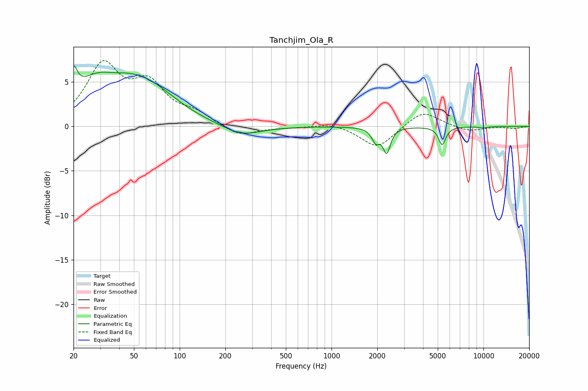

# Tanchjim_Ola_R
See [usage instructions](https://github.com/jaakkopasanen/AutoEq#usage) for more options and info.

### Parametric EQs
Apply preamp of -6.9 dB when using parametric equalizer.

|   # | Type    |   Fc (Hz) |    Q |   Gain (dB) |
|-----|---------|-----------|------|-------------|
|   1 | Peaking |        20 | 5.98 |         2.7 |
|   2 | Peaking |        33 | 0.74 |         6.7 |
|   3 | Peaking |        36 | 1.33 |        -1.9 |
|   4 | Peaking |        65 | 0.77 |         2.6 |
|   5 | Peaking |       256 | 1.1  |        -1.2 |
|   6 | Peaking |      1956 | 5.77 |        -3.2 |
|   7 | Peaking |      1959 | 5.89 |         1.7 |
|   8 | Peaking |      2307 | 5.97 |        -2.7 |
|   9 | Peaking |      5343 | 6    |        -2   |
|  10 | Peaking |     10000 | 4.75 |        -0.2 |

### Fixed Band EQs
When using fixed band (also called graphic) equalizer, apply preamp of **-7.5 dB** (if available) and set gains manually with these parameters.

|   # | Type    |   Fc (Hz) |    Q |   Gain (dB) |
|-----|---------|-----------|------|-------------|
|   1 | Peaking |        31 | 1.41 |         6.6 |
|   2 | Peaking |        62 | 1.41 |         4.2 |
|   3 | Peaking |       125 | 1.41 |         1.2 |
|   4 | Peaking |       250 | 1.41 |        -1.2 |
|   5 | Peaking |       500 | 1.41 |        -0.1 |
|   6 | Peaking |      1000 | 1.41 |         0.4 |
|   7 | Peaking |      2000 | 1.41 |        -2.5 |
|   8 | Peaking |      4000 | 1.41 |         1.9 |
|   9 | Peaking |      8000 | 1.41 |        -0.6 |
|  10 | Peaking |     16000 | 1.41 |        -0.2 |

### Graphs

