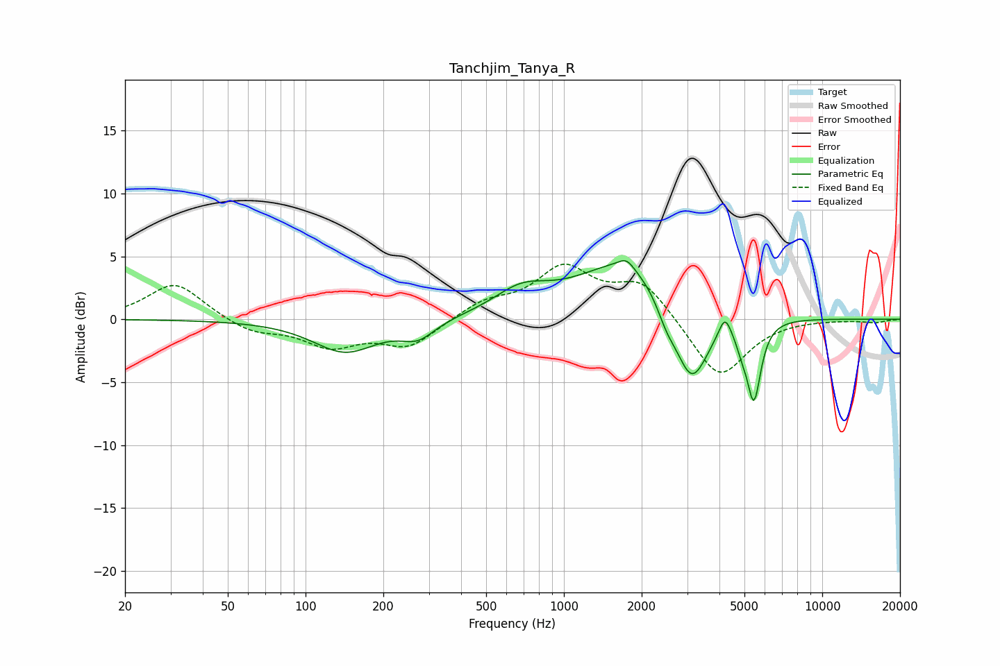

# Tanchjim_Tanya_R
See [usage instructions](https://github.com/jaakkopasanen/AutoEq#usage) for more options and info.

### Parametric EQs
Apply preamp of -4.8 dB when using parametric equalizer.

|   # | Type    |   Fc (Hz) |    Q |   Gain (dB) |
|-----|---------|-----------|------|-------------|
|   1 | Peaking |       142 | 1.14 |        -2.6 |
|   2 | Peaking |       272 | 2.15 |        -1.3 |
|   3 | Peaking |       684 | 1.33 |         1.8 |
|   4 | Peaking |      1746 | 4.82 |         0.7 |
|   5 | Peaking |      1770 | 0.75 |         4.8 |
|   6 | Peaking |      2493 | 3.8  |        -1.3 |
|   7 | Peaking |      3116 | 2.08 |        -6.6 |
|   8 | Peaking |      4199 | 6    |         1.7 |
|   9 | Peaking |      4883 | 6    |        -1   |
|  10 | Peaking |      5439 | 5.18 |        -6.2 |

### Fixed Band EQs
When using fixed band (also called graphic) equalizer, apply preamp of **-4.5 dB** (if available) and set gains manually with these parameters.

|   # | Type    |   Fc (Hz) |    Q |   Gain (dB) |
|-----|---------|-----------|------|-------------|
|   1 | Peaking |        31 | 1.41 |         2.9 |
|   2 | Peaking |        62 | 1.41 |        -1   |
|   3 | Peaking |       125 | 1.41 |        -2   |
|   4 | Peaking |       250 | 1.41 |        -2.1 |
|   5 | Peaking |       500 | 1.41 |         1.3 |
|   6 | Peaking |      1000 | 1.41 |         3.9 |
|   7 | Peaking |      2000 | 1.41 |         2.9 |
|   8 | Peaking |      4000 | 1.41 |        -4.8 |
|   9 | Peaking |      8000 | 1.41 |         0   |
|  10 | Peaking |     16000 | 1.41 |        -0.2 |

### Graphs

