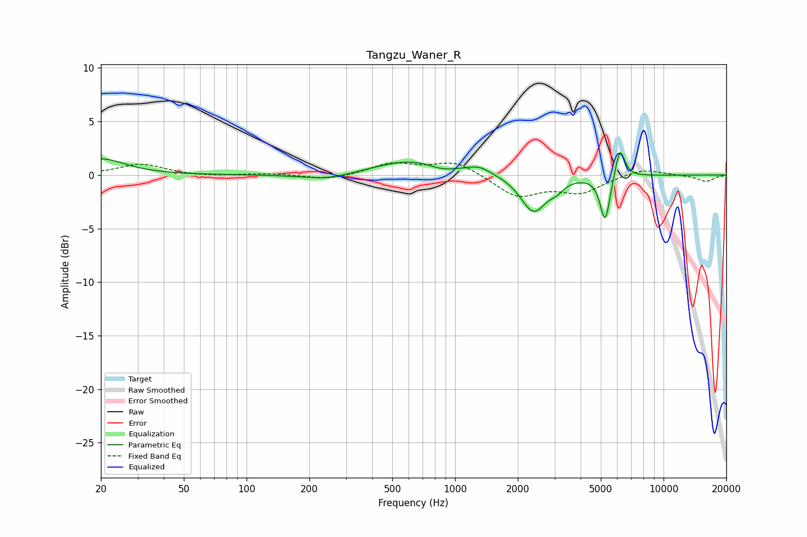

# Tangzu_Waner_R
See [usage instructions](https://github.com/jaakkopasanen/AutoEq#usage) for more options and info.

### Parametric EQs
Apply preamp of -2.2 dB when using parametric equalizer.

|   # | Type    |   Fc (Hz) |    Q |   Gain (dB) |
|-----|---------|-----------|------|-------------|
|   1 | Peaking |        20 | 1.26 |         1.5 |
|   2 | Peaking |       245 | 1.14 |        -0.6 |
|   3 | Peaking |       632 | 0.76 |         1.5 |
|   4 | Peaking |       862 | 2.07 |        -0.5 |
|   5 | Peaking |      1303 | 2.58 |         0.6 |
|   6 | Peaking |      2371 | 2.32 |        -3.3 |
|   7 | Peaking |      2605 | 2.31 |        -0.2 |
|   8 | Peaking |      3077 | 4.66 |        -0.6 |
|   9 | Peaking |      5248 | 5.91 |        -4.4 |
|  10 | Peaking |      6173 | 5.95 |         2.9 |

### Fixed Band EQs
When using fixed band (also called graphic) equalizer, apply preamp of **-1.2 dB** (if available) and set gains manually with these parameters.

|   # | Type    |   Fc (Hz) |    Q |   Gain (dB) |
|-----|---------|-----------|------|-------------|
|   1 | Peaking |        31 | 1.41 |         1   |
|   2 | Peaking |        62 | 1.41 |        -0.1 |
|   3 | Peaking |       125 | 1.41 |         0.1 |
|   4 | Peaking |       250 | 1.41 |        -0.5 |
|   5 | Peaking |       500 | 1.41 |         1.1 |
|   6 | Peaking |      1000 | 1.41 |         1.3 |
|   7 | Peaking |      2000 | 1.41 |        -2   |
|   8 | Peaking |      4000 | 1.41 |        -1.5 |
|   9 | Peaking |      8000 | 1.41 |         0.6 |
|  10 | Peaking |     16000 | 1.41 |        -0.6 |

### Graphs

