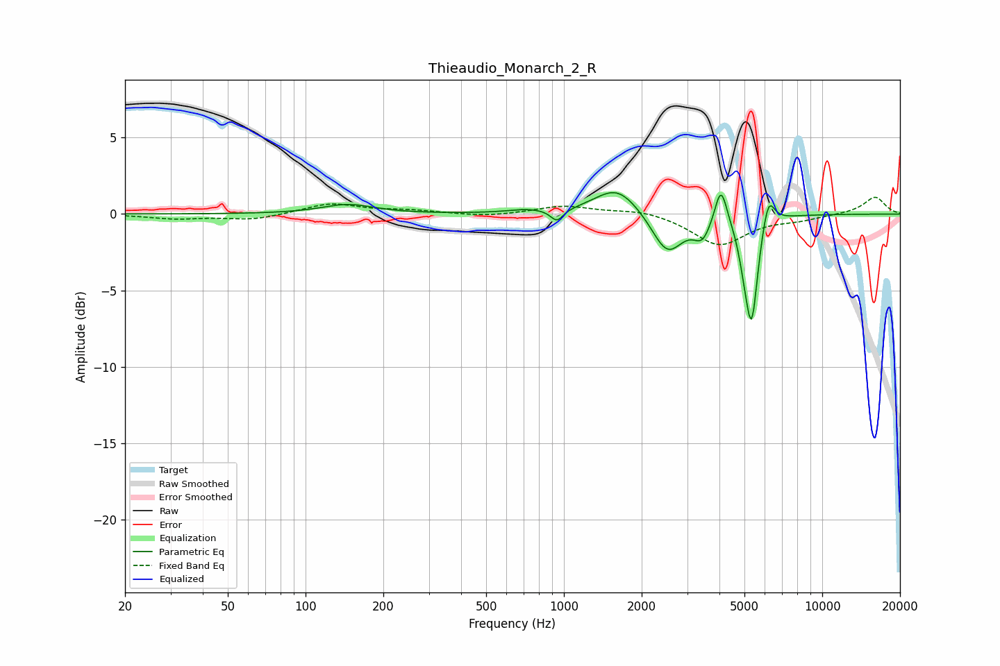

# Thieaudio_Monarch_2_R
See [usage instructions](https://github.com/jaakkopasanen/AutoEq#usage) for more options and info.

### Parametric EQs
Apply preamp of -1.5 dB when using parametric equalizer.

|   # | Type    |   Fc (Hz) |    Q |   Gain (dB) |
|-----|---------|-----------|------|-------------|
|   1 | Peaking |       146 | 1.41 |         0.6 |
|   2 | Peaking |       714 | 2.01 |         0.2 |
|   3 | Peaking |       940 | 5.72 |        -0.8 |
|   4 | Peaking |      1606 | 1.64 |         1.9 |
|   5 | Peaking |      2514 | 2.35 |        -2.7 |
|   6 | Peaking |      3436 | 4.24 |        -1.3 |
|   7 | Peaking |      4054 | 6    |         2.6 |
|   8 | Peaking |      4984 | 5.99 |        -1.4 |
|   9 | Peaking |      5331 | 5.9  |        -6.6 |
|  10 | Peaking |      6192 | 5.97 |         1.9 |

### Fixed Band EQs
When using fixed band (also called graphic) equalizer, apply preamp of **-1.2 dB** (if available) and set gains manually with these parameters.

|   # | Type    |   Fc (Hz) |    Q |   Gain (dB) |
|-----|---------|-----------|------|-------------|
|   1 | Peaking |        31 | 1.41 |        -0.3 |
|   2 | Peaking |        62 | 1.41 |        -0.4 |
|   3 | Peaking |       125 | 1.41 |         0.7 |
|   4 | Peaking |       250 | 1.41 |         0.2 |
|   5 | Peaking |       500 | 1.41 |        -0.2 |
|   6 | Peaking |      1000 | 1.41 |         0.5 |
|   7 | Peaking |      2000 | 1.41 |         0.3 |
|   8 | Peaking |      4000 | 1.41 |        -2   |
|   9 | Peaking |      8000 | 1.41 |        -0.3 |
|  10 | Peaking |     16000 | 1.41 |         1.1 |

### Graphs

