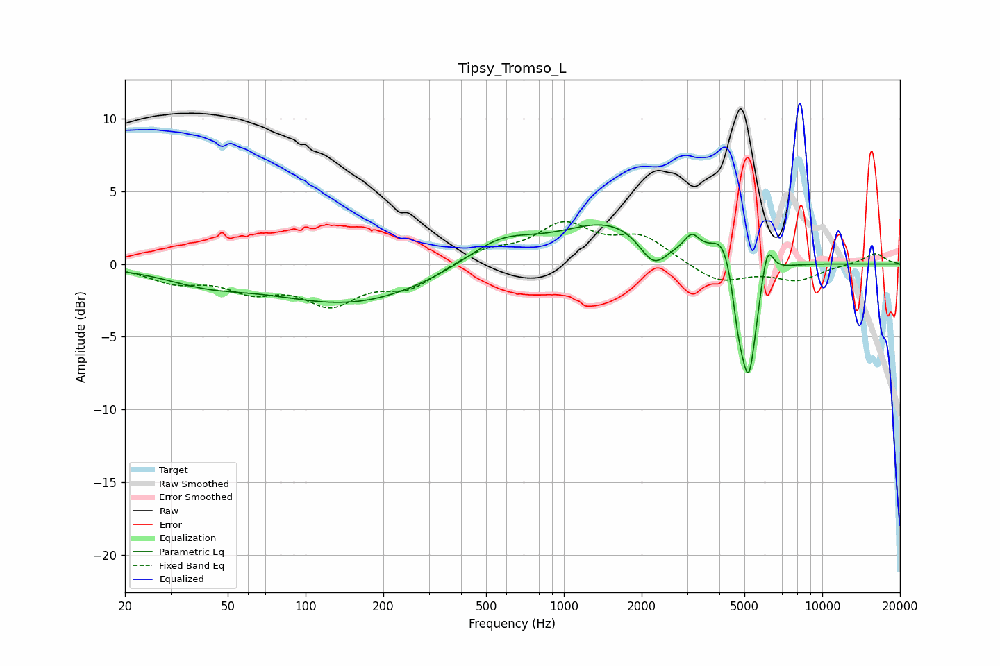

# Tipsy_Tromso_L
See [usage instructions](https://github.com/jaakkopasanen/AutoEq#usage) for more options and info.

### Parametric EQs
Apply preamp of -2.8 dB when using parametric equalizer.

|   # | Type    |   Fc (Hz) |    Q |   Gain (dB) |
|-----|---------|-----------|------|-------------|
|   1 | Peaking |        41 | 0.87 |        -0.9 |
|   2 | Peaking |       151 | 0.46 |        -2.7 |
|   3 | Peaking |       564 | 1.03 |         1.7 |
|   4 | Peaking |      1545 | 0.71 |         2.9 |
|   5 | Peaking |      2221 | 2.55 |        -2.1 |
|   6 | Peaking |      3129 | 4.82 |         1.1 |
|   7 | Peaking |      4161 | 3.1  |         2.2 |
|   8 | Peaking |      4729 | 6    |        -2.6 |
|   9 | Peaking |      5199 | 4.34 |        -8   |
|  10 | Peaking |      6126 | 5.98 |         2.5 |

### Fixed Band EQs
When using fixed band (also called graphic) equalizer, apply preamp of **-3.0 dB** (if available) and set gains manually with these parameters.

|   # | Type    |   Fc (Hz) |    Q |   Gain (dB) |
|-----|---------|-----------|------|-------------|
|   1 | Peaking |        31 | 1.41 |        -1.1 |
|   2 | Peaking |        62 | 1.41 |        -1.5 |
|   3 | Peaking |       125 | 1.41 |        -2.5 |
|   4 | Peaking |       250 | 1.41 |        -1.5 |
|   5 | Peaking |       500 | 1.41 |         0.9 |
|   6 | Peaking |      1000 | 1.41 |         2.6 |
|   7 | Peaking |      2000 | 1.41 |         1.8 |
|   8 | Peaking |      4000 | 1.41 |        -1.3 |
|   9 | Peaking |      8000 | 1.41 |        -1   |
|  10 | Peaking |     16000 | 1.41 |         0.8 |

### Graphs

