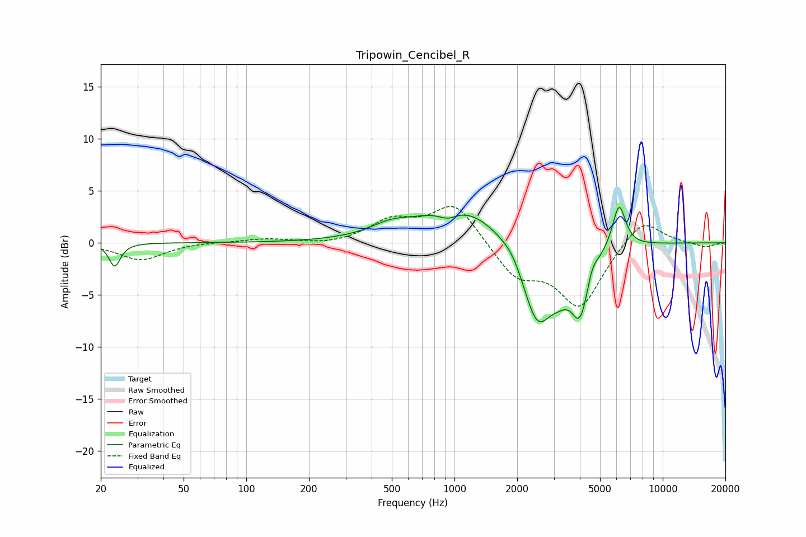

# Tripowin_Cencibel_R
See [usage instructions](https://github.com/jaakkopasanen/AutoEq#usage) for more options and info.

### Parametric EQs
Apply preamp of -3.5 dB when using parametric equalizer.

|   # | Type    |   Fc (Hz) |    Q |   Gain (dB) |
|-----|---------|-----------|------|-------------|
|   1 | Peaking |        23 | 5.45 |        -2.3 |
|   2 | Peaking |       491 | 1.52 |         0.9 |
|   3 | Peaking |       929 | 3.03 |        -0.8 |
|   4 | Peaking |      1084 | 0.69 |         3.7 |
|   5 | Peaking |      1908 | 3.07 |         0.7 |
|   6 | Peaking |      2494 | 1.83 |        -7.9 |
|   7 | Peaking |      3200 | 2.53 |        -1.8 |
|   8 | Peaking |      4014 | 3.21 |        -5.6 |
|   9 | Peaking |      4575 | 5.96 |         1.1 |
|  10 | Peaking |      6168 | 4.37 |         4.3 |

### Fixed Band EQs
When using fixed band (also called graphic) equalizer, apply preamp of **-3.6 dB** (if available) and set gains manually with these parameters.

|   # | Type    |   Fc (Hz) |    Q |   Gain (dB) |
|-----|---------|-----------|------|-------------|
|   1 | Peaking |        31 | 1.41 |        -1.7 |
|   2 | Peaking |        62 | 1.41 |         0.1 |
|   3 | Peaking |       125 | 1.41 |         0.4 |
|   4 | Peaking |       250 | 1.41 |        -0.3 |
|   5 | Peaking |       500 | 1.41 |         2   |
|   6 | Peaking |      1000 | 1.41 |         3.8 |
|   7 | Peaking |      2000 | 1.41 |        -3.1 |
|   8 | Peaking |      4000 | 1.41 |        -6   |
|   9 | Peaking |      8000 | 1.41 |         2.6 |
|  10 | Peaking |     16000 | 1.41 |        -0.4 |

### Graphs

