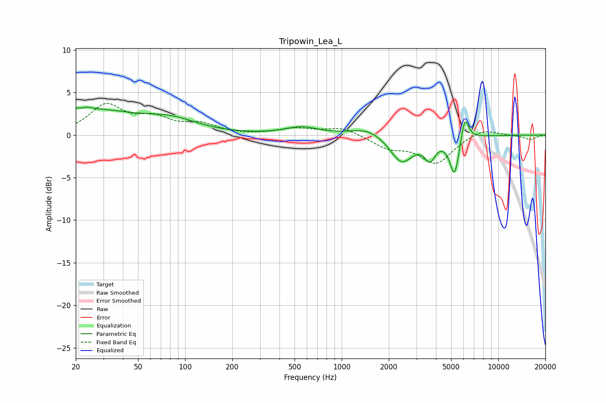

# Tripowin_Lea_L
See [usage instructions](https://github.com/jaakkopasanen/AutoEq#usage) for more options and info.

### Parametric EQs
Apply preamp of -3.4 dB when using parametric equalizer.

|   # | Type    |   Fc (Hz) |    Q |   Gain (dB) |
|-----|---------|-----------|------|-------------|
|   1 | Peaking |        22 | 6    |        -2.7 |
|   2 | Peaking |        22 | 5.49 |         2.8 |
|   3 | Peaking |        22 | 0.39 |         2.9 |
|   4 | Peaking |        84 | 0.87 |         1.2 |
|   5 | Peaking |       553 | 1.37 |         0.9 |
|   6 | Peaking |      1473 | 1.36 |         1   |
|   7 | Peaking |      2410 | 1.9  |        -3.3 |
|   8 | Peaking |      3660 | 4.1  |        -2.2 |
|   9 | Peaking |      5256 | 4.63 |        -4.6 |
|  10 | Peaking |      6113 | 5.59 |         3.1 |

### Fixed Band EQs
When using fixed band (also called graphic) equalizer, apply preamp of **-3.8 dB** (if available) and set gains manually with these parameters.

|   # | Type    |   Fc (Hz) |    Q |   Gain (dB) |
|-----|---------|-----------|------|-------------|
|   1 | Peaking |        31 | 1.41 |         3.4 |
|   2 | Peaking |        62 | 1.41 |         1.7 |
|   3 | Peaking |       125 | 1.41 |         1.1 |
|   4 | Peaking |       250 | 1.41 |        -0   |
|   5 | Peaking |       500 | 1.41 |         0.7 |
|   6 | Peaking |      1000 | 1.41 |         0.9 |
|   7 | Peaking |      2000 | 1.41 |        -1.4 |
|   8 | Peaking |      4000 | 1.41 |        -3.2 |
|   9 | Peaking |      8000 | 1.41 |         0.9 |
|  10 | Peaking |     16000 | 1.41 |        -0.5 |

### Graphs

