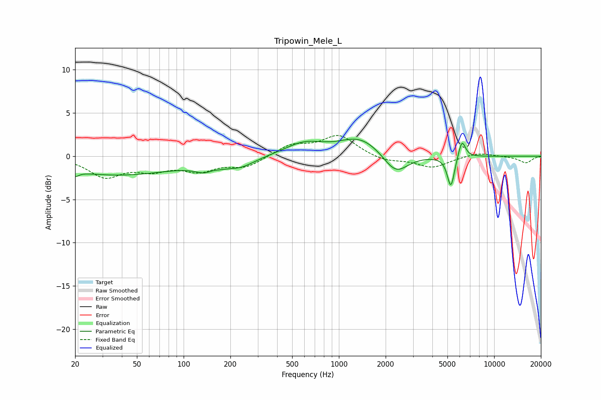

# Tripowin_Mele_L
See [usage instructions](https://github.com/jaakkopasanen/AutoEq#usage) for more options and info.

### Parametric EQs
Apply preamp of -2.1 dB when using parametric equalizer.

|   # | Type    |   Fc (Hz) |    Q |   Gain (dB) |
|-----|---------|-----------|------|-------------|
|   1 | Peaking |        20 | 5.82 |        -0.6 |
|   2 | Peaking |        37 | 0.36 |        -2.1 |
|   3 | Peaking |       146 | 2.08 |        -1.7 |
|   4 | Peaking |       151 | 3.01 |         0.9 |
|   5 | Peaking |       233 | 1.56 |        -0.9 |
|   6 | Peaking |       596 | 1.14 |         1.4 |
|   7 | Peaking |      1375 | 1.04 |         2.1 |
|   8 | Peaking |      2320 | 1.77 |        -2.4 |
|   9 | Peaking |      5265 | 6    |        -3.6 |
|  10 | Peaking |      6200 | 6    |         2.1 |

### Fixed Band EQs
When using fixed band (also called graphic) equalizer, apply preamp of **-2.5 dB** (if available) and set gains manually with these parameters.

|   # | Type    |   Fc (Hz) |    Q |   Gain (dB) |
|-----|---------|-----------|------|-------------|
|   1 | Peaking |        31 | 1.41 |        -2.3 |
|   2 | Peaking |        62 | 1.41 |        -1.3 |
|   3 | Peaking |       125 | 1.41 |        -1.5 |
|   4 | Peaking |       250 | 1.41 |        -1.2 |
|   5 | Peaking |       500 | 1.41 |         1.3 |
|   6 | Peaking |      1000 | 1.41 |         2.4 |
|   7 | Peaking |      2000 | 1.41 |        -0.6 |
|   8 | Peaking |      4000 | 1.41 |        -1.3 |
|   9 | Peaking |      8000 | 1.41 |         0.5 |
|  10 | Peaking |     16000 | 1.41 |        -0.8 |

### Graphs

