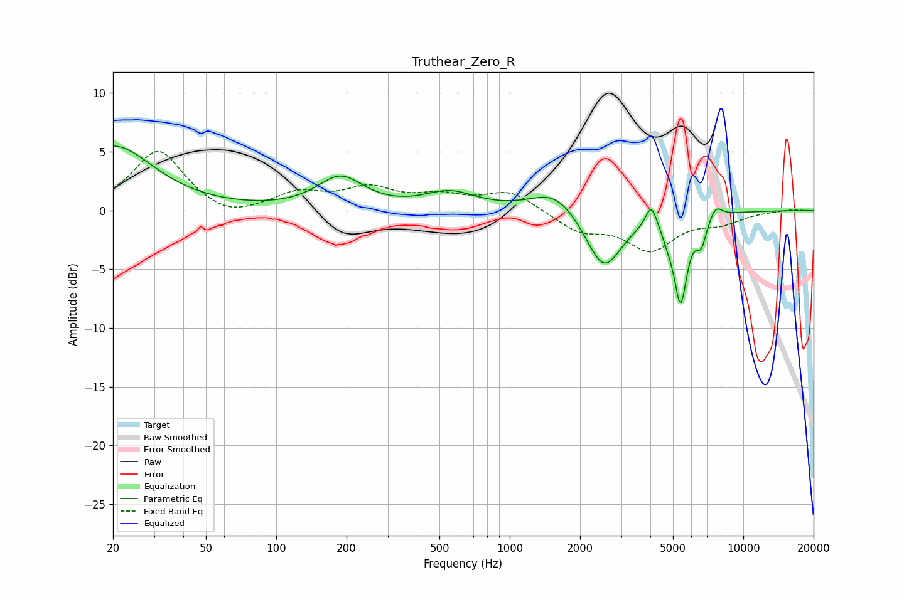

# Truthear_Zero_R
See [usage instructions](https://github.com/jaakkopasanen/AutoEq#usage) for more options and info.

### Parametric EQs
Apply preamp of -5.6 dB when using parametric equalizer.

|   # | Type    |   Fc (Hz) |    Q |   Gain (dB) |
|-----|---------|-----------|------|-------------|
|   1 | Peaking |        20 | 0.83 |         5.5 |
|   2 | Peaking |       188 | 1.44 |         2.7 |
|   3 | Peaking |       554 | 1.3  |         1.4 |
|   4 | Peaking |      1562 | 1.4  |         2   |
|   5 | Peaking |      2529 | 1.82 |        -5.1 |
|   6 | Peaking |      4036 | 5.87 |         2   |
|   7 | Peaking |      4749 | 5.64 |        -0.8 |
|   8 | Peaking |      5389 | 4.91 |        -7.2 |
|   9 | Peaking |      6607 | 6    |        -2.1 |
|  10 | Peaking |      7623 | 4.95 |         1   |

### Fixed Band EQs
When using fixed band (also called graphic) equalizer, apply preamp of **-5.1 dB** (if available) and set gains manually with these parameters.

|   # | Type    |   Fc (Hz) |    Q |   Gain (dB) |
|-----|---------|-----------|------|-------------|
|   1 | Peaking |        31 | 1.41 |         5.1 |
|   2 | Peaking |        62 | 1.41 |        -0.9 |
|   3 | Peaking |       125 | 1.41 |         1.4 |
|   4 | Peaking |       250 | 1.41 |         1.7 |
|   5 | Peaking |       500 | 1.41 |         1.1 |
|   6 | Peaking |      1000 | 1.41 |         1.6 |
|   7 | Peaking |      2000 | 1.41 |        -1.6 |
|   8 | Peaking |      4000 | 1.41 |        -3.2 |
|   9 | Peaking |      8000 | 1.41 |        -0.9 |
|  10 | Peaking |     16000 | 1.41 |         0.1 |

### Graphs

