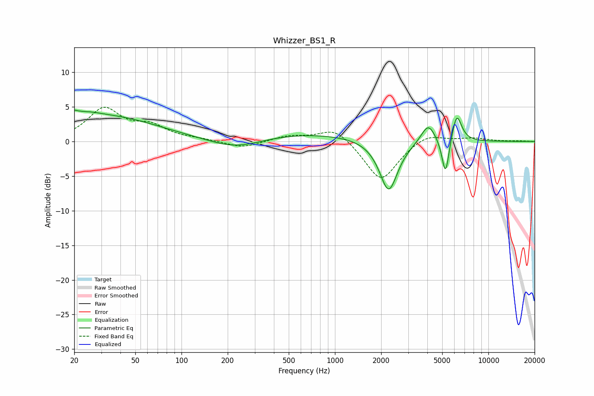

# Whizzer_BS1_R
See [usage instructions](https://github.com/jaakkopasanen/AutoEq#usage) for more options and info.

### Parametric EQs
Apply preamp of -4.6 dB when using parametric equalizer.

|   # | Type    |   Fc (Hz) |    Q |   Gain (dB) |
|-----|---------|-----------|------|-------------|
|   1 | Peaking |        20 | 5.53 |         2.8 |
|   2 | Peaking |        21 | 6    |        -1.9 |
|   3 | Peaking |        23 | 1.53 |         0.9 |
|   4 | Peaking |        33 | 0.43 |         3.5 |
|   5 | Peaking |       227 | 0.81 |        -1.7 |
|   6 | Peaking |       590 | 0.34 |         1.2 |
|   7 | Peaking |      2239 | 2.37 |        -7.5 |
|   8 | Peaking |      4054 | 3.05 |         2.8 |
|   9 | Peaking |      5256 | 5.9  |        -5.6 |
|  10 | Peaking |      6213 | 4.32 |         4.2 |

### Fixed Band EQs
When using fixed band (also called graphic) equalizer, apply preamp of **-5.0 dB** (if available) and set gains manually with these parameters.

|   # | Type    |   Fc (Hz) |    Q |   Gain (dB) |
|-----|---------|-----------|------|-------------|
|   1 | Peaking |        31 | 1.41 |         4.6 |
|   2 | Peaking |        62 | 1.41 |         1.9 |
|   3 | Peaking |       125 | 1.41 |         0.2 |
|   4 | Peaking |       250 | 1.41 |        -1   |
|   5 | Peaking |       500 | 1.41 |         0.8 |
|   6 | Peaking |      1000 | 1.41 |         2.1 |
|   7 | Peaking |      2000 | 1.41 |        -5.8 |
|   8 | Peaking |      4000 | 1.41 |         1.3 |
|   9 | Peaking |      8000 | 1.41 |         0.5 |
|  10 | Peaking |     16000 | 1.41 |         0.1 |

### Graphs

