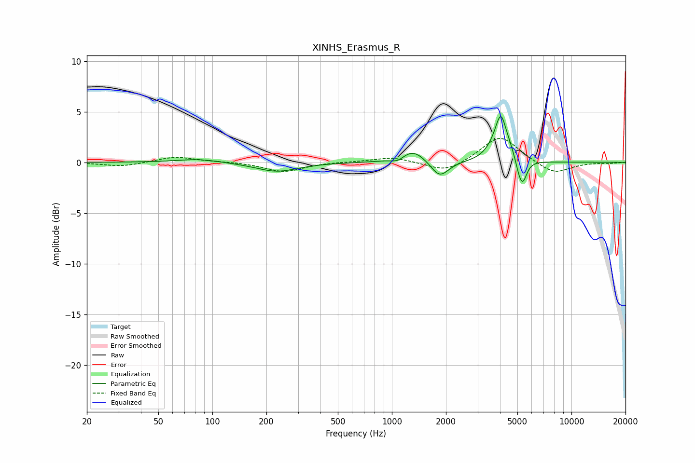

# XINHS_Erasmus_R
See [usage instructions](https://github.com/jaakkopasanen/AutoEq#usage) for more options and info.

### Parametric EQs
Apply preamp of -4.6 dB when using parametric equalizer.

|   # | Type    |   Fc (Hz) |    Q |   Gain (dB) |
|-----|---------|-----------|------|-------------|
|   1 | Peaking |        84 | 1.19 |         0.4 |
|   2 | Peaking |       228 | 1.2  |        -0.9 |
|   3 | Peaking |      1080 | 3.88 |        -0.5 |
|   4 | Peaking |      1308 | 2.01 |         1.3 |
|   5 | Peaking |      1845 | 2.84 |        -1.7 |
|   6 | Peaking |      3768 | 2.75 |         1.1 |
|   7 | Peaking |      4048 | 4.81 |         3.5 |
|   8 | Peaking |      4554 | 4.43 |         0.7 |
|   9 | Peaking |      5098 | 5.97 |        -0.8 |
|  10 | Peaking |      5347 | 5.95 |        -2.1 |

### Fixed Band EQs
When using fixed band (also called graphic) equalizer, apply preamp of **-2.5 dB** (if available) and set gains manually with these parameters.

|   # | Type    |   Fc (Hz) |    Q |   Gain (dB) |
|-----|---------|-----------|------|-------------|
|   1 | Peaking |        31 | 1.41 |        -0.4 |
|   2 | Peaking |        62 | 1.41 |         0.6 |
|   3 | Peaking |       125 | 1.41 |         0.1 |
|   4 | Peaking |       250 | 1.41 |        -0.9 |
|   5 | Peaking |       500 | 1.41 |         0   |
|   6 | Peaking |      1000 | 1.41 |         0.5 |
|   7 | Peaking |      2000 | 1.41 |        -1.1 |
|   8 | Peaking |      4000 | 1.41 |         2.7 |
|   9 | Peaking |      8000 | 1.41 |        -1.2 |
|  10 | Peaking |     16000 | 1.41 |        -0.1 |

### Graphs

