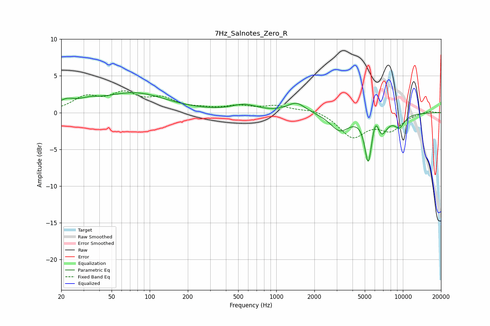

# 7Hz_Salnotes_Zero_R
See [usage instructions](https://github.com/jaakkopasanen/AutoEq#usage) for more options and info.

### Parametric EQs
Apply preamp of -2.8 dB when using parametric equalizer.

|   # | Type    |   Fc (Hz) |    Q |   Gain (dB) |
|-----|---------|-----------|------|-------------|
|   1 | Peaking |        22 | 2.15 |         1.1 |
|   2 | Peaking |        33 | 1.75 |         0.6 |
|   3 | Peaking |        75 | 0.55 |         2.6 |
|   4 | Peaking |       560 | 1.42 |         0.9 |
|   5 | Peaking |      1442 | 2.05 |         1.4 |
|   6 | Peaking |      3176 | 1.87 |        -2.3 |
|   7 | Peaking |      5326 | 5.06 |        -6.2 |
|   8 | Peaking |      6101 | 4.62 |         2.4 |
|   9 | Peaking |      6727 | 2.92 |        -2.8 |
|  10 | Peaking |      9395 | 3.07 |        -1.6 |

### Fixed Band EQs
When using fixed band (also called graphic) equalizer, apply preamp of **-3.1 dB** (if available) and set gains manually with these parameters.

|   # | Type    |   Fc (Hz) |    Q |   Gain (dB) |
|-----|---------|-----------|------|-------------|
|   1 | Peaking |        31 | 1.41 |         1.9 |
|   2 | Peaking |        62 | 1.41 |         2.3 |
|   3 | Peaking |       125 | 1.41 |         1.7 |
|   4 | Peaking |       250 | 1.41 |         0.4 |
|   5 | Peaking |       500 | 1.41 |         0.8 |
|   6 | Peaking |      1000 | 1.41 |         0.8 |
|   7 | Peaking |      2000 | 1.41 |         0.5 |
|   8 | Peaking |      4000 | 1.41 |        -3.2 |
|   9 | Peaking |      8000 | 1.41 |        -2.2 |
|  10 | Peaking |     16000 | 1.41 |         0.3 |

### Graphs

