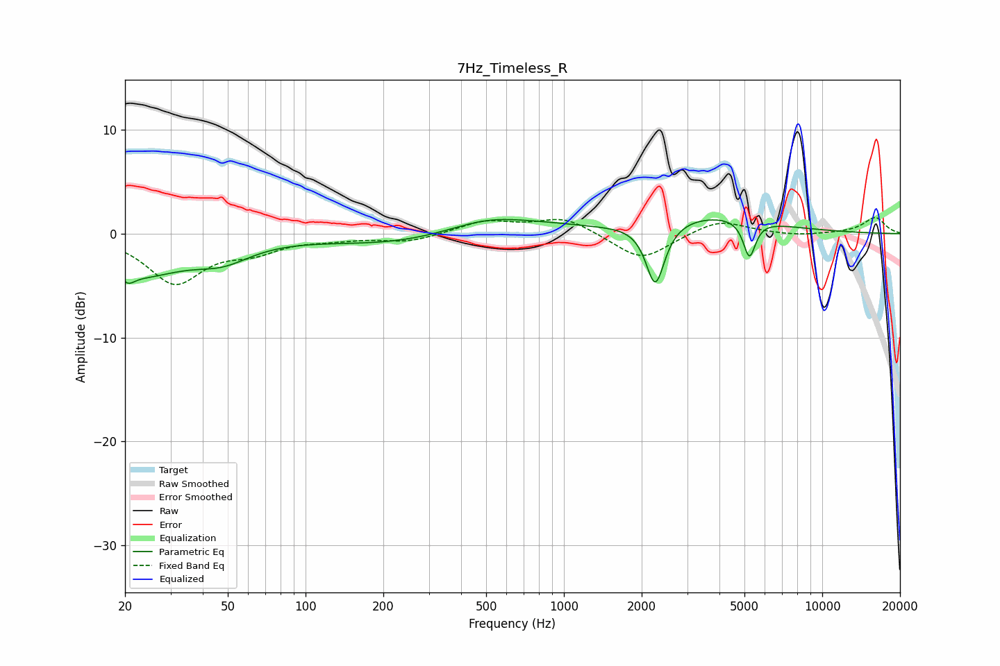

# 7Hz_Timeless_R
See [usage instructions](https://github.com/jaakkopasanen/AutoEq#usage) for more options and info.

### Parametric EQs
Apply preamp of -1.5 dB when using parametric equalizer.

|   # | Type    |   Fc (Hz) |    Q |   Gain (dB) |
|-----|---------|-----------|------|-------------|
|   1 | Peaking |        21 | 5.67 |        -4.3 |
|   2 | Peaking |        21 | 5.82 |         3.3 |
|   3 | Peaking |        23 | 0.84 |        -3.6 |
|   4 | Peaking |        48 | 1.25 |        -1.8 |
|   5 | Peaking |       234 | 0.49 |        -1.1 |
|   6 | Peaking |       507 | 0.84 |         1.7 |
|   7 | Peaking |       900 | 0.94 |         0.4 |
|   8 | Peaking |      2258 | 3.96 |        -6   |
|   9 | Peaking |      3763 | 0.63 |         1.8 |
|  10 | Peaking |      5225 | 5.98 |        -3.6 |

### Fixed Band EQs
When using fixed band (also called graphic) equalizer, apply preamp of **-1.6 dB** (if available) and set gains manually with these parameters.

|   # | Type    |   Fc (Hz) |    Q |   Gain (dB) |
|-----|---------|-----------|------|-------------|
|   1 | Peaking |        31 | 1.41 |        -4.6 |
|   2 | Peaking |        62 | 1.41 |        -1.4 |
|   3 | Peaking |       125 | 1.41 |        -0.4 |
|   4 | Peaking |       250 | 1.41 |        -0.8 |
|   5 | Peaking |       500 | 1.41 |         1.2 |
|   6 | Peaking |      1000 | 1.41 |         1.6 |
|   7 | Peaking |      2000 | 1.41 |        -2.6 |
|   8 | Peaking |      4000 | 1.41 |         1.4 |
|   9 | Peaking |      8000 | 1.41 |        -0.2 |
|  10 | Peaking |     16000 | 1.41 |         1.6 |

### Graphs

