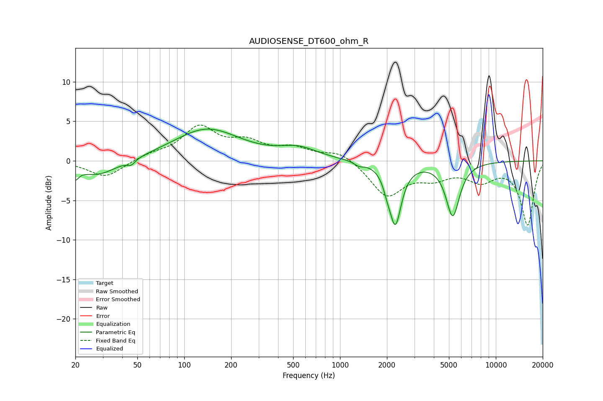

# AUDIOSENSE_DT600_ohm_R
See [usage instructions](https://github.com/jaakkopasanen/AutoEq#usage) for more options and info.

### Parametric EQs
Apply preamp of -4.1 dB when using parametric equalizer.

|   # | Type    |   Fc (Hz) |    Q |   Gain (dB) |
|-----|---------|-----------|------|-------------|
|   1 | Peaking |        20 | 5.95 |        -2.5 |
|   2 | Peaking |        20 | 6    |         1.1 |
|   3 | Peaking |        28 | 1.13 |        -2   |
|   4 | Peaking |        46 | 5.54 |        -0.7 |
|   5 | Peaking |       139 | 0.66 |         4   |
|   6 | Peaking |       541 | 1.16 |         1.4 |
|   7 | Peaking |      1324 | 4.67 |        -0.5 |
|   8 | Peaking |      2003 | 6    |        -1   |
|   9 | Peaking |      2264 | 3.64 |        -7.7 |
|  10 | Peaking |      5293 | 3.19 |        -6.8 |

### Fixed Band EQs
When using fixed band (also called graphic) equalizer, apply preamp of **-4.6 dB** (if available) and set gains manually with these parameters.

|   # | Type    |   Fc (Hz) |    Q |   Gain (dB) |
|-----|---------|-----------|------|-------------|
|   1 | Peaking |        31 | 1.41 |        -2.1 |
|   2 | Peaking |        62 | 1.41 |         0.7 |
|   3 | Peaking |       125 | 1.41 |         4.1 |
|   4 | Peaking |       250 | 1.41 |         2   |
|   5 | Peaking |       500 | 1.41 |         1.4 |
|   6 | Peaking |      1000 | 1.41 |         1.3 |
|   7 | Peaking |      2000 | 1.41 |        -4.4 |
|   8 | Peaking |      4000 | 1.41 |        -1.7 |
|   9 | Peaking |      8000 | 1.41 |        -2.2 |
|  10 | Peaking |     16000 | 1.41 |        -8   |

### Graphs

