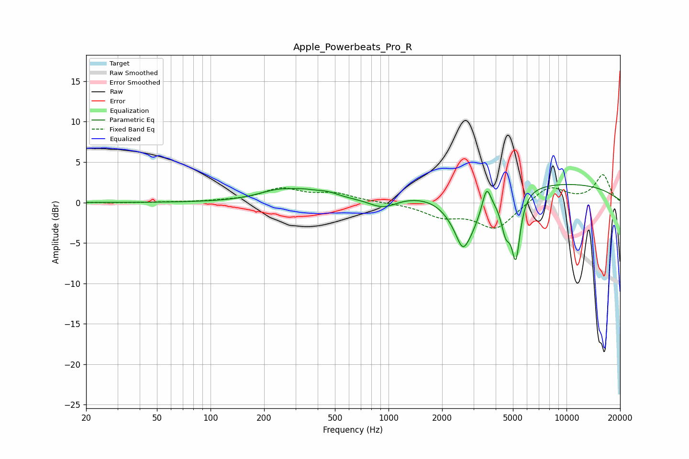

# Apple_Powerbeats_Pro_R
See [usage instructions](https://github.com/jaakkopasanen/AutoEq#usage) for more options and info.

### Parametric EQs
Apply preamp of -2.3 dB when using parametric equalizer.

|   # | Type    |   Fc (Hz) |    Q |   Gain (dB) |
|-----|---------|-----------|------|-------------|
|   1 | Peaking |       243 | 1.17 |         1.3 |
|   2 | Peaking |       338 | 2    |         0.5 |
|   3 | Peaking |       452 | 2.07 |         0.7 |
|   4 | Peaking |       933 | 1.78 |        -1.3 |
|   5 | Peaking |      2602 | 5    |        -1.4 |
|   6 | Peaking |      2702 | 1.73 |        -6.4 |
|   7 | Peaking |      3554 | 5.93 |         3   |
|   8 | Peaking |      4559 | 5.33 |        -3.8 |
|   9 | Peaking |      5193 | 5.8  |        -7.7 |
|  10 | Peaking |      6059 | 0.18 |         2.6 |

### Fixed Band EQs
When using fixed band (also called graphic) equalizer, apply preamp of **-3.5 dB** (if available) and set gains manually with these parameters.

|   # | Type    |   Fc (Hz) |    Q |   Gain (dB) |
|-----|---------|-----------|------|-------------|
|   1 | Peaking |        31 | 1.41 |        -0   |
|   2 | Peaking |        62 | 1.41 |         0   |
|   3 | Peaking |       125 | 1.41 |         0.1 |
|   4 | Peaking |       250 | 1.41 |         1.6 |
|   5 | Peaking |       500 | 1.41 |         1   |
|   6 | Peaking |      1000 | 1.41 |        -0   |
|   7 | Peaking |      2000 | 1.41 |        -1.5 |
|   8 | Peaking |      4000 | 1.41 |        -3.2 |
|   9 | Peaking |      8000 | 1.41 |         2.1 |
|  10 | Peaking |     16000 | 1.41 |         3.4 |

### Graphs

