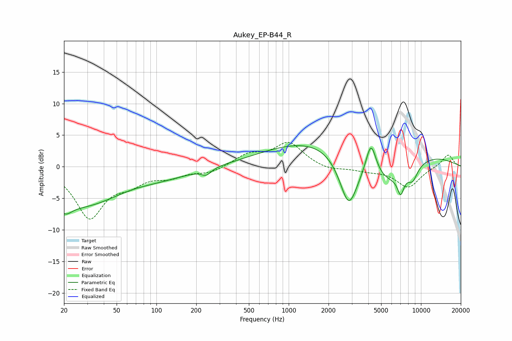

# Aukey_EP-B44_R
See [usage instructions](https://github.com/jaakkopasanen/AutoEq#usage) for more options and info.

### Parametric EQs
Apply preamp of -3.4 dB when using parametric equalizer.

|   # | Type    |   Fc (Hz) |    Q |   Gain (dB) |
|-----|---------|-----------|------|-------------|
|   1 | Peaking |        21 | 3.31 |        -1.2 |
|   2 | Peaking |        29 | 0.27 |        -7   |
|   3 | Peaking |        62 | 0.7  |         1.8 |
|   4 | Peaking |       238 | 3.96 |        -1   |
|   5 | Peaking |      2841 | 1.98 |        -8.4 |
|   6 | Peaking |      3468 | 0.19 |         5.8 |
|   7 | Peaking |      4188 | 3.56 |         5.3 |
|   8 | Peaking |      5649 | 0.66 |        -6.9 |
|   9 | Peaking |      7023 | 5.47 |        -2.9 |
|  10 | Peaking |      8653 | 3.4  |        -2.1 |

### Fixed Band EQs
When using fixed band (also called graphic) equalizer, apply preamp of **-4.0 dB** (if available) and set gains manually with these parameters.

|   # | Type    |   Fc (Hz) |    Q |   Gain (dB) |
|-----|---------|-----------|------|-------------|
|   1 | Peaking |        31 | 1.41 |        -7.9 |
|   2 | Peaking |        62 | 1.41 |        -2.1 |
|   3 | Peaking |       125 | 1.41 |        -1.4 |
|   4 | Peaking |       250 | 1.41 |        -0.9 |
|   5 | Peaking |       500 | 1.41 |         1.8 |
|   6 | Peaking |      1000 | 1.41 |         3.7 |
|   7 | Peaking |      2000 | 1.41 |        -0.6 |
|   8 | Peaking |      4000 | 1.41 |        -0.5 |
|   9 | Peaking |      8000 | 1.41 |        -3.2 |
|  10 | Peaking |     16000 | 1.41 |         2   |

### Graphs

