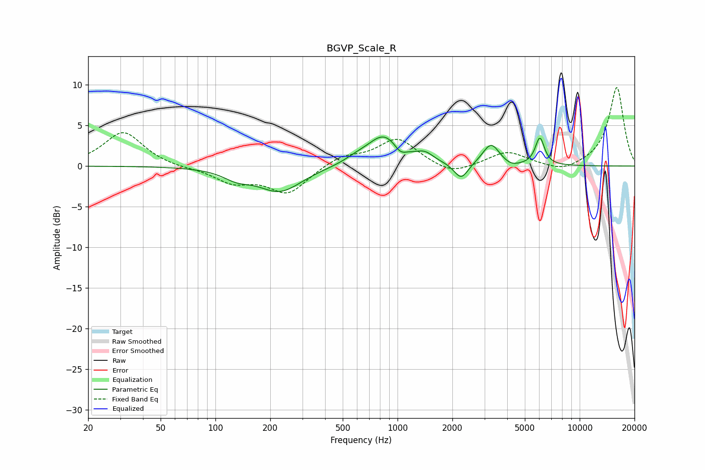

# BGVP_Scale_R
See [usage instructions](https://github.com/jaakkopasanen/AutoEq#usage) for more options and info.

### Parametric EQs
Apply preamp of -3.7 dB when using parametric equalizer.

|   # | Type    |   Fc (Hz) |    Q |   Gain (dB) |
|-----|---------|-----------|------|-------------|
|   1 | Peaking |       131 | 1.87 |        -1   |
|   2 | Peaking |       227 | 1.17 |        -3.1 |
|   3 | Peaking |       587 | 2.35 |         0.4 |
|   4 | Peaking |       842 | 1.51 |         3.8 |
|   5 | Peaking |      1033 | 4.33 |        -1   |
|   6 | Peaking |      1413 | 2.99 |         1   |
|   7 | Peaking |      2236 | 3.7  |        -2   |
|   8 | Peaking |      3262 | 3.04 |         2.7 |
|   9 | Peaking |      4204 | 3.3  |        -0.5 |
|  10 | Peaking |      6044 | 5.53 |         3.4 |

### Fixed Band EQs
When using fixed band (also called graphic) equalizer, apply preamp of **-9.8 dB** (if available) and set gains manually with these parameters.

|   # | Type    |   Fc (Hz) |    Q |   Gain (dB) |
|-----|---------|-----------|------|-------------|
|   1 | Peaking |        31 | 1.41 |         4.2 |
|   2 | Peaking |        62 | 1.41 |        -0.2 |
|   3 | Peaking |       125 | 1.41 |        -1.9 |
|   4 | Peaking |       250 | 1.41 |        -3.3 |
|   5 | Peaking |       500 | 1.41 |         1.2 |
|   6 | Peaking |      1000 | 1.41 |         3.3 |
|   7 | Peaking |      2000 | 1.41 |        -1.2 |
|   8 | Peaking |      4000 | 1.41 |         1.8 |
|   9 | Peaking |      8000 | 1.41 |        -0.9 |
|  10 | Peaking |     16000 | 1.41 |         9.7 |

### Graphs

