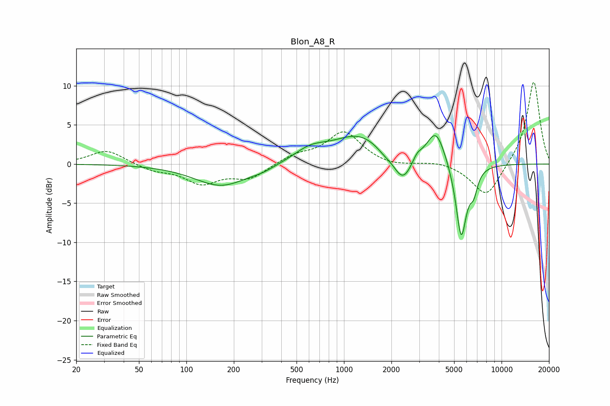

# Blon_A8_R
See [usage instructions](https://github.com/jaakkopasanen/AutoEq#usage) for more options and info.

### Parametric EQs
Apply preamp of -3.7 dB when using parametric equalizer.

|   # | Type    |   Fc (Hz) |    Q |   Gain (dB) |
|-----|---------|-----------|------|-------------|
|   1 | Peaking |       167 | 0.83 |        -2.8 |
|   2 | Peaking |       306 | 1.92 |        -0.4 |
|   3 | Peaking |       610 | 1.37 |         1.5 |
|   4 | Peaking |      1257 | 0.82 |         3.6 |
|   5 | Peaking |      1799 | 2.67 |        -0.6 |
|   6 | Peaking |      2363 | 2.38 |        -3.5 |
|   7 | Peaking |      2911 | 4.95 |         0.9 |
|   8 | Peaking |      3833 | 2.36 |         4.5 |
|   9 | Peaking |      5546 | 3.94 |        -9.8 |
|  10 | Peaking |      6655 | 5.62 |        -2.3 |

### Fixed Band EQs
When using fixed band (also called graphic) equalizer, apply preamp of **-10.5 dB** (if available) and set gains manually with these parameters.

|   # | Type    |   Fc (Hz) |    Q |   Gain (dB) |
|-----|---------|-----------|------|-------------|
|   1 | Peaking |        31 | 1.41 |         1.8 |
|   2 | Peaking |        62 | 1.41 |        -0.8 |
|   3 | Peaking |       125 | 1.41 |        -2.3 |
|   4 | Peaking |       250 | 1.41 |        -1.8 |
|   5 | Peaking |       500 | 1.41 |         1.1 |
|   6 | Peaking |      1000 | 1.41 |         4.1 |
|   7 | Peaking |      2000 | 1.41 |        -0.4 |
|   8 | Peaking |      4000 | 1.41 |         0.4 |
|   9 | Peaking |      8000 | 1.41 |        -4.3 |
|  10 | Peaking |     16000 | 1.41 |        10.7 |

### Graphs

