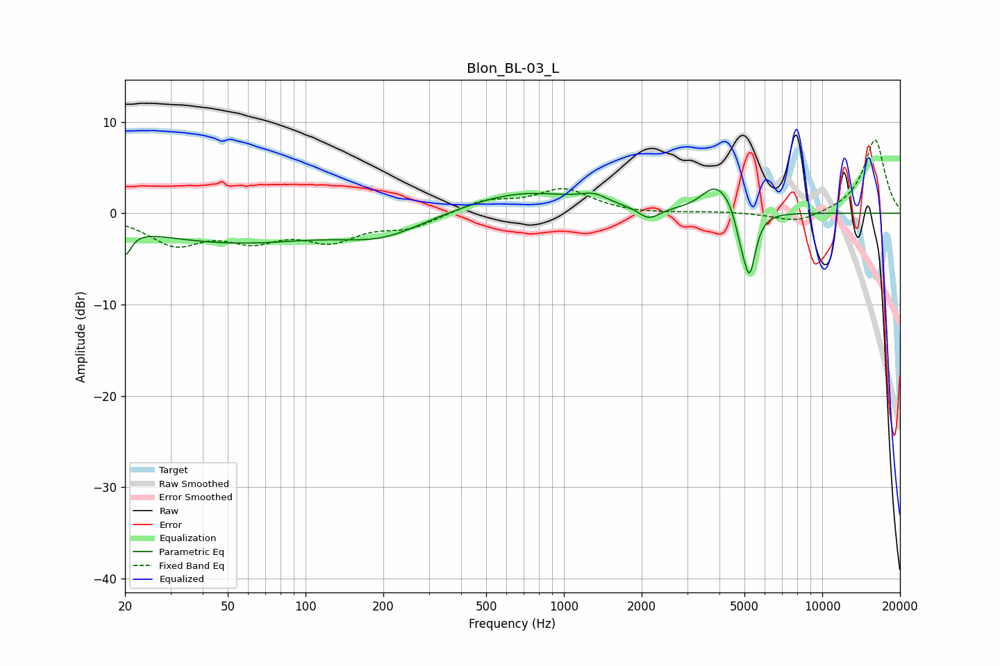

# Blon_BL-03_L
See [usage instructions](https://github.com/jaakkopasanen/AutoEq#usage) for more options and info.

### Parametric EQs
Apply preamp of -2.8 dB when using parametric equalizer.

|   # | Type    |   Fc (Hz) |    Q |   Gain (dB) |
|-----|---------|-----------|------|-------------|
|   1 | Peaking |        20 | 5.89 |        -2.8 |
|   2 | Peaking |        52 | 0.41 |        -3.1 |
|   3 | Peaking |       198 | 0.87 |        -2.1 |
|   4 | Peaking |       687 | 0.64 |         2.4 |
|   5 | Peaking |      1305 | 2.68 |         0.9 |
|   6 | Peaking |      2135 | 3.54 |        -1.3 |
|   7 | Peaking |      3843 | 2.55 |         2.7 |
|   8 | Peaking |      4403 | 3.22 |         0.9 |
|   9 | Peaking |      4827 | 5.99 |        -2   |
|  10 | Peaking |      5230 | 5.73 |        -6.7 |

### Fixed Band EQs
When using fixed band (also called graphic) equalizer, apply preamp of **-8.1 dB** (if available) and set gains manually with these parameters.

|   # | Type    |   Fc (Hz) |    Q |   Gain (dB) |
|-----|---------|-----------|------|-------------|
|   1 | Peaking |        31 | 1.41 |        -3.1 |
|   2 | Peaking |        62 | 1.41 |        -2.5 |
|   3 | Peaking |       125 | 1.41 |        -2.6 |
|   4 | Peaking |       250 | 1.41 |        -1.5 |
|   5 | Peaking |       500 | 1.41 |         1.4 |
|   6 | Peaking |      1000 | 1.41 |         2.5 |
|   7 | Peaking |      2000 | 1.41 |        -0.1 |
|   8 | Peaking |      4000 | 1.41 |         0.1 |
|   9 | Peaking |      8000 | 1.41 |        -1.1 |
|  10 | Peaking |     16000 | 1.41 |         8.1 |

### Graphs

