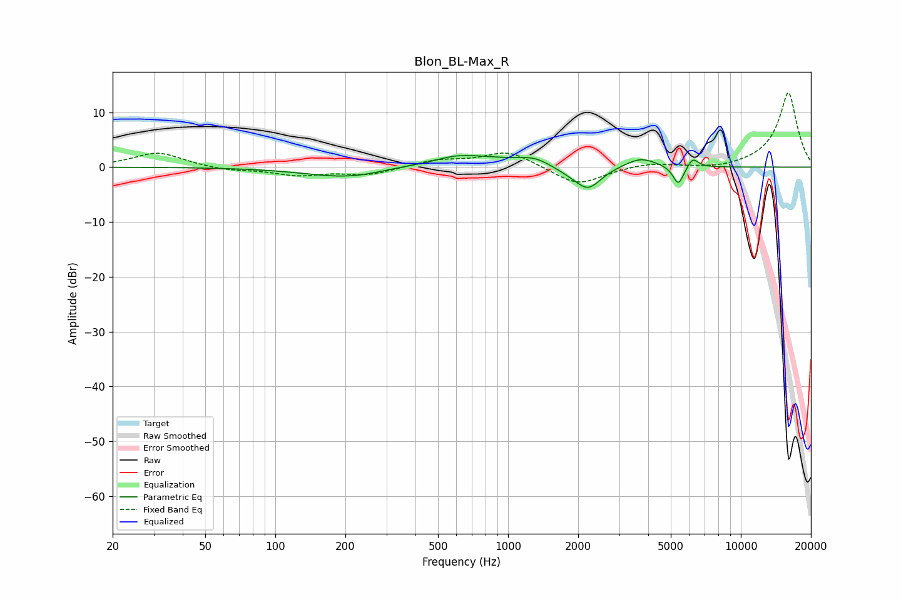

# Blon_BL-Max_R
See [usage instructions](https://github.com/jaakkopasanen/AutoEq#usage) for more options and info.

### Parametric EQs
Apply preamp of -2.2 dB when using parametric equalizer.

|   # | Type    |   Fc (Hz) |    Q |   Gain (dB) |
|-----|---------|-----------|------|-------------|
|   1 | Peaking |       207 | 0.77 |        -2   |
|   2 | Peaking |       325 | 1.48 |         0.3 |
|   3 | Peaking |       580 | 2.25 |         0.4 |
|   4 | Peaking |       694 | 0.83 |         2   |
|   5 | Peaking |      1301 | 1.98 |         1.4 |
|   6 | Peaking |      1811 | 1.87 |        -0.8 |
|   7 | Peaking |      2207 | 2.54 |        -3.9 |
|   8 | Peaking |      3711 | 2.09 |         1.8 |
|   9 | Peaking |      5390 | 6    |        -3.5 |
|  10 | Peaking |      6223 | 5.99 |         1.8 |

### Fixed Band EQs
When using fixed band (also called graphic) equalizer, apply preamp of **-13.6 dB** (if available) and set gains manually with these parameters.

|   # | Type    |   Fc (Hz) |    Q |   Gain (dB) |
|-----|---------|-----------|------|-------------|
|   1 | Peaking |        31 | 1.41 |         2.7 |
|   2 | Peaking |        62 | 1.41 |        -0.6 |
|   3 | Peaking |       125 | 1.41 |        -1.4 |
|   4 | Peaking |       250 | 1.41 |        -1.4 |
|   5 | Peaking |       500 | 1.41 |         1.2 |
|   6 | Peaking |      1000 | 1.41 |         2.9 |
|   7 | Peaking |      2000 | 1.41 |        -3.4 |
|   8 | Peaking |      4000 | 1.41 |         0.8 |
|   9 | Peaking |      8000 | 1.41 |        -0.5 |
|  10 | Peaking |     16000 | 1.41 |        13.7 |

### Graphs

