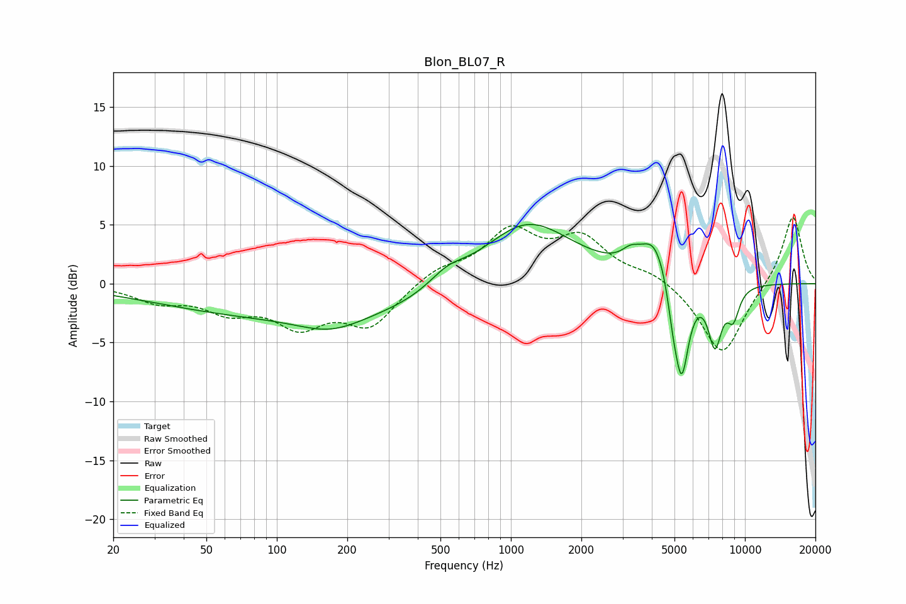

# Blon_BL07_R
See [usage instructions](https://github.com/jaakkopasanen/AutoEq#usage) for more options and info.

### Parametric EQs
Apply preamp of -5.1 dB when using parametric equalizer.

|   # | Type    |   Fc (Hz) |    Q |   Gain (dB) |
|-----|---------|-----------|------|-------------|
|   1 | Peaking |       154 | 0.18 |        -2.9 |
|   2 | Peaking |       170 | 1.04 |        -1.3 |
|   3 | Peaking |       535 | 1.75 |         1.3 |
|   4 | Peaking |      1157 | 0.7  |         5.9 |
|   5 | Peaking |      3243 | 3.77 |         0.9 |
|   6 | Peaking |      4134 | 2.15 |         3.6 |
|   7 | Peaking |      4916 | 5.96 |        -2   |
|   8 | Peaking |      5359 | 4.3  |        -8.4 |
|   9 | Peaking |      7443 | 4.52 |        -4.9 |
|  10 | Peaking |      8910 | 4.84 |        -2.5 |

### Fixed Band EQs
When using fixed band (also called graphic) equalizer, apply preamp of **-5.7 dB** (if available) and set gains manually with these parameters.

|   # | Type    |   Fc (Hz) |    Q |   Gain (dB) |
|-----|---------|-----------|------|-------------|
|   1 | Peaking |        31 | 1.41 |        -1.4 |
|   2 | Peaking |        62 | 1.41 |        -2   |
|   3 | Peaking |       125 | 1.41 |        -3.2 |
|   4 | Peaking |       250 | 1.41 |        -3.4 |
|   5 | Peaking |       500 | 1.41 |         1.2 |
|   6 | Peaking |      1000 | 1.41 |         4.2 |
|   7 | Peaking |      2000 | 1.41 |         3.6 |
|   8 | Peaking |      4000 | 1.41 |         0.9 |
|   9 | Peaking |      8000 | 1.41 |        -6.2 |
|  10 | Peaking |     16000 | 1.41 |         5.9 |

### Graphs

