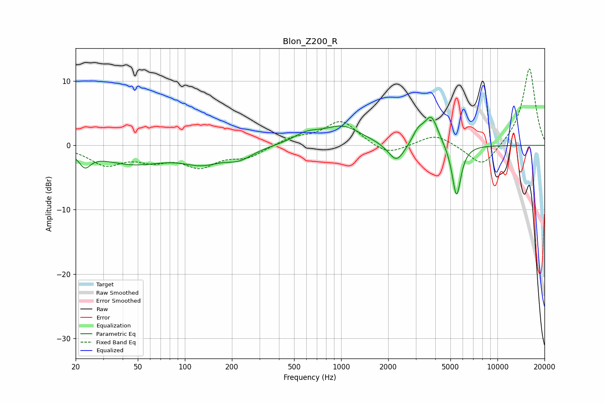

# Blon_Z200_R
See [usage instructions](https://github.com/jaakkopasanen/AutoEq#usage) for more options and info.

### Parametric EQs
Apply preamp of -4.5 dB when using parametric equalizer.

|   # | Type    |   Fc (Hz) |    Q |   Gain (dB) |
|-----|---------|-----------|------|-------------|
|   1 | Peaking |        23 | 3.89 |        -2.2 |
|   2 | Peaking |        46 | 0.67 |        -2.7 |
|   3 | Peaking |       129 | 1.15 |        -2.1 |
|   4 | Peaking |       222 | 1.6  |        -1.6 |
|   5 | Peaking |       601 | 1.62 |         1.4 |
|   6 | Peaking |      1024 | 1.16 |         2.8 |
|   7 | Peaking |      2261 | 2.67 |        -3.1 |
|   8 | Peaking |      3111 | 3.78 |         1.9 |
|   9 | Peaking |      3776 | 3.19 |         4.5 |
|  10 | Peaking |      5473 | 4.9  |        -8.3 |

### Fixed Band EQs
When using fixed band (also called graphic) equalizer, apply preamp of **-12.0 dB** (if available) and set gains manually with these parameters.

|   # | Type    |   Fc (Hz) |    Q |   Gain (dB) |
|-----|---------|-----------|------|-------------|
|   1 | Peaking |        31 | 1.41 |        -2.8 |
|   2 | Peaking |        62 | 1.41 |        -1.9 |
|   3 | Peaking |       125 | 1.41 |        -3   |
|   4 | Peaking |       250 | 1.41 |        -1.7 |
|   5 | Peaking |       500 | 1.41 |         1.1 |
|   6 | Peaking |      1000 | 1.41 |         3.8 |
|   7 | Peaking |      2000 | 1.41 |        -1.7 |
|   8 | Peaking |      4000 | 1.41 |         1.8 |
|   9 | Peaking |      8000 | 1.41 |        -3.6 |
|  10 | Peaking |     16000 | 1.41 |        12.1 |

### Graphs

