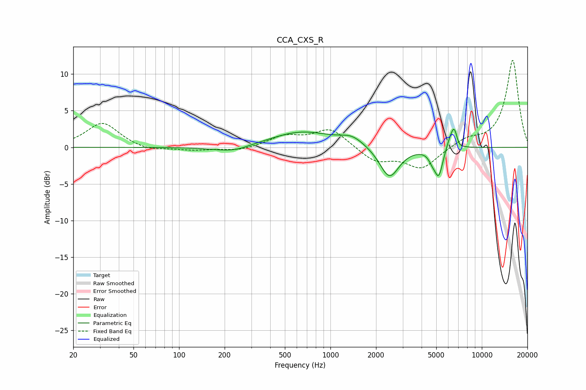

# CCA_CXS_R
See [usage instructions](https://github.com/jaakkopasanen/AutoEq#usage) for more options and info.

### Parametric EQs
Apply preamp of -2.6 dB when using parametric equalizer.

|   # | Type    |   Fc (Hz) |    Q |   Gain (dB) |
|-----|---------|-----------|------|-------------|
|   1 | Peaking |       237 | 1.03 |        -1   |
|   2 | Peaking |       304 | 1.82 |         0.2 |
|   3 | Peaking |       639 | 0.67 |         2.2 |
|   4 | Peaking |      1391 | 1.82 |         1.1 |
|   5 | Peaking |      2451 | 2.2  |        -4.3 |
|   6 | Peaking |      4706 | 6    |        -0.9 |
|   7 | Peaking |      5190 | 5.17 |        -3.7 |
|   8 | Peaking |      6071 | 5.99 |         0.8 |
|   9 | Peaking |      6558 | 5.81 |         3   |
|  10 | Peaking |      7013 | 6    |        -0.7 |

### Fixed Band EQs
When using fixed band (also called graphic) equalizer, apply preamp of **-12.0 dB** (if available) and set gains manually with these parameters.

|   # | Type    |   Fc (Hz) |    Q |   Gain (dB) |
|-----|---------|-----------|------|-------------|
|   1 | Peaking |        31 | 1.41 |         3.4 |
|   2 | Peaking |        62 | 1.41 |        -0.6 |
|   3 | Peaking |       125 | 1.41 |        -0.4 |
|   4 | Peaking |       250 | 1.41 |        -0.5 |
|   5 | Peaking |       500 | 1.41 |         1.4 |
|   6 | Peaking |      1000 | 1.41 |         2.5 |
|   7 | Peaking |      2000 | 1.41 |        -1.9 |
|   8 | Peaking |      4000 | 1.41 |        -2.8 |
|   9 | Peaking |      8000 | 1.41 |         1.1 |
|  10 | Peaking |     16000 | 1.41 |        11.9 |

### Graphs

