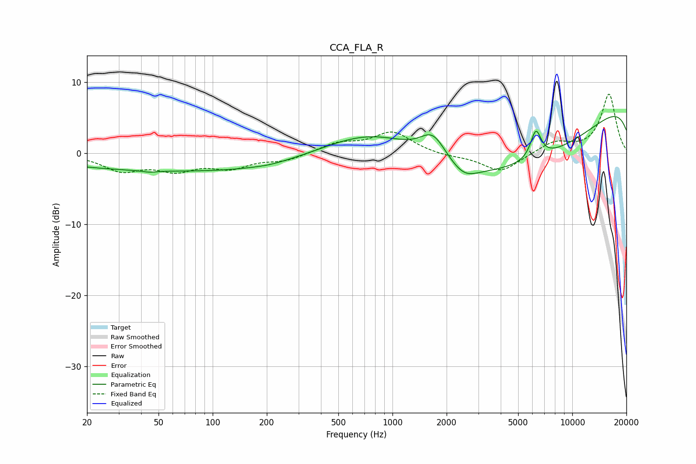

# CCA_FLA_R
See [usage instructions](https://github.com/jaakkopasanen/AutoEq#usage) for more options and info.

### Parametric EQs
Apply preamp of -5.3 dB when using parametric equalizer.

|   # | Type    |   Fc (Hz) |    Q |   Gain (dB) |
|-----|---------|-----------|------|-------------|
|   1 | Peaking |        45 | 3.84 |        -0.2 |
|   2 | Peaking |        60 | 0.2  |        -2.4 |
|   3 | Peaking |       206 | 2.1  |        -0.1 |
|   4 | Peaking |       536 | 0.31 |        -1.6 |
|   5 | Peaking |       820 | 0.46 |         6.3 |
|   6 | Peaking |      1679 | 1.97 |         3.6 |
|   7 | Peaking |      2499 | 1.9  |        -1.7 |
|   8 | Peaking |      4973 | 0.23 |       -12.1 |
|   9 | Peaking |      6278 | 4.6  |         4   |
|  10 | Peaking |     10000 | 0.18 |        11.3 |

### Fixed Band EQs
When using fixed band (also called graphic) equalizer, apply preamp of **-8.4 dB** (if available) and set gains manually with these parameters.

|   # | Type    |   Fc (Hz) |    Q |   Gain (dB) |
|-----|---------|-----------|------|-------------|
|   1 | Peaking |        31 | 1.41 |        -2.3 |
|   2 | Peaking |        62 | 1.41 |        -2.1 |
|   3 | Peaking |       125 | 1.41 |        -1.8 |
|   4 | Peaking |       250 | 1.41 |        -1   |
|   5 | Peaking |       500 | 1.41 |         1.3 |
|   6 | Peaking |      1000 | 1.41 |         2.9 |
|   7 | Peaking |      2000 | 1.41 |        -0.4 |
|   8 | Peaking |      4000 | 1.41 |        -2.7 |
|   9 | Peaking |      8000 | 1.41 |         1.6 |
|  10 | Peaking |     16000 | 1.41 |         8.3 |

### Graphs

