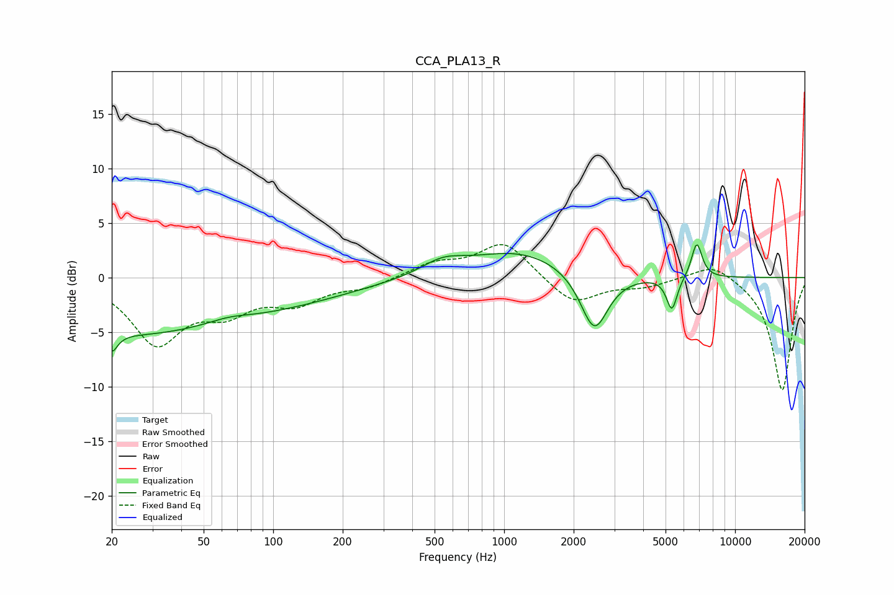

# CCA_PLA13_R
See [usage instructions](https://github.com/jaakkopasanen/AutoEq#usage) for more options and info.

### Parametric EQs
Apply preamp of -3.1 dB when using parametric equalizer.

|   # | Type    |   Fc (Hz) |    Q |   Gain (dB) |
|-----|---------|-----------|------|-------------|
|   1 | Peaking |        20 | 6    |         4.2 |
|   2 | Peaking |        20 | 5.97 |        -5.9 |
|   3 | Peaking |        22 | 0.34 |        -4.8 |
|   4 | Peaking |        64 | 1.49 |         0.5 |
|   5 | Peaking |       111 | 0.44 |        -1.8 |
|   6 | Peaking |       542 | 1.51 |         1.2 |
|   7 | Peaking |      1164 | 0.66 |         2.4 |
|   8 | Peaking |      2457 | 2.35 |        -5.5 |
|   9 | Peaking |      5324 | 6    |        -3   |
|  10 | Peaking |      6824 | 5.91 |         3.3 |

### Fixed Band EQs
When using fixed band (also called graphic) equalizer, apply preamp of **-3.1 dB** (if available) and set gains manually with these parameters.

|   # | Type    |   Fc (Hz) |    Q |   Gain (dB) |
|-----|---------|-----------|------|-------------|
|   1 | Peaking |        31 | 1.41 |        -5.8 |
|   2 | Peaking |        62 | 1.41 |        -2.6 |
|   3 | Peaking |       125 | 1.41 |        -2.1 |
|   4 | Peaking |       250 | 1.41 |        -0.8 |
|   5 | Peaking |       500 | 1.41 |         1.2 |
|   6 | Peaking |      1000 | 1.41 |         3.3 |
|   7 | Peaking |      2000 | 1.41 |        -2.5 |
|   8 | Peaking |      4000 | 1.41 |        -0.7 |
|   9 | Peaking |      8000 | 1.41 |         1.5 |
|  10 | Peaking |     16000 | 1.41 |       -10.4 |

### Graphs

