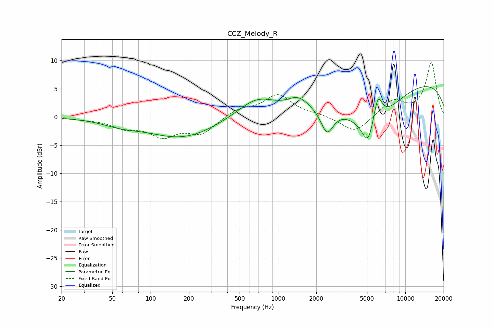

# CCZ_Melody_R
See [usage instructions](https://github.com/jaakkopasanen/AutoEq#usage) for more options and info.

### Parametric EQs
Apply preamp of -5.5 dB when using parametric equalizer.

|   # | Type    |   Fc (Hz) |    Q |   Gain (dB) |
|-----|---------|-----------|------|-------------|
|   1 | Peaking |        58 | 0.99 |        -1   |
|   2 | Peaking |       178 | 0.53 |        -3.7 |
|   3 | Peaking |       684 | 0.93 |         3.4 |
|   4 | Peaking |      1296 | 1.07 |        -0.8 |
|   5 | Peaking |      1423 | 1.6  |         2.6 |
|   6 | Peaking |      2428 | 2.79 |        -4.5 |
|   7 | Peaking |      5093 | 3.08 |        -4.3 |
|   8 | Peaking |      5463 | 0.67 |        -7.1 |
|   9 | Peaking |      6077 | 3.84 |         5   |
|  10 | Peaking |      9478 | 0.19 |         7   |

### Fixed Band EQs
When using fixed band (also called graphic) equalizer, apply preamp of **-9.7 dB** (if available) and set gains manually with these parameters.

|   # | Type    |   Fc (Hz) |    Q |   Gain (dB) |
|-----|---------|-----------|------|-------------|
|   1 | Peaking |        31 | 1.41 |        -0.3 |
|   2 | Peaking |        62 | 1.41 |        -1.7 |
|   3 | Peaking |       125 | 1.41 |        -3.1 |
|   4 | Peaking |       250 | 1.41 |        -2.8 |
|   5 | Peaking |       500 | 1.41 |         1.4 |
|   6 | Peaking |      1000 | 1.41 |         3.8 |
|   7 | Peaking |      2000 | 1.41 |         0.4 |
|   8 | Peaking |      4000 | 1.41 |        -2.9 |
|   9 | Peaking |      8000 | 1.41 |         2.9 |
|  10 | Peaking |     16000 | 1.41 |         9.6 |

### Graphs

