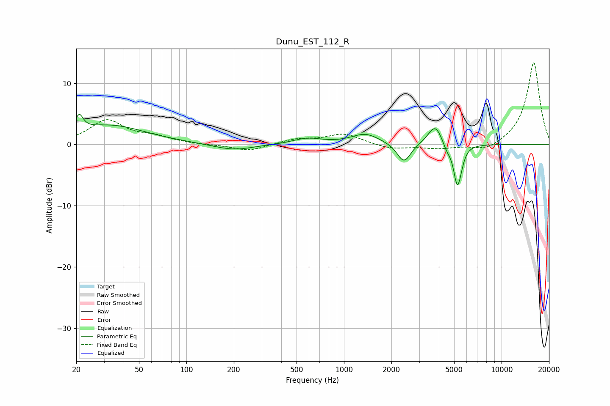

# Dunu_EST_112_R
See [usage instructions](https://github.com/jaakkopasanen/AutoEq#usage) for more options and info.

### Parametric EQs
Apply preamp of -5.0 dB when using parametric equalizer.

|   # | Type    |   Fc (Hz) |    Q |   Gain (dB) |
|-----|---------|-----------|------|-------------|
|   1 | Peaking |        21 | 5.81 |         2.5 |
|   2 | Peaking |        32 | 0.61 |         3.1 |
|   3 | Peaking |       199 | 1.12 |        -1   |
|   4 | Peaking |       584 | 1.58 |         1   |
|   5 | Peaking |      1371 | 1.6  |         1.7 |
|   6 | Peaking |      2402 | 3.29 |        -3.2 |
|   7 | Peaking |      3797 | 3.09 |         3.4 |
|   8 | Peaking |      4494 | 5.45 |        -1.2 |
|   9 | Peaking |      5232 | 6    |        -6.1 |
|  10 | Peaking |      5498 | 6    |        -1.2 |

### Fixed Band EQs
When using fixed band (also called graphic) equalizer, apply preamp of **-13.4 dB** (if available) and set gains manually with these parameters.

|   # | Type    |   Fc (Hz) |    Q |   Gain (dB) |
|-----|---------|-----------|------|-------------|
|   1 | Peaking |        31 | 1.41 |         3.8 |
|   2 | Peaking |        62 | 1.41 |         1.1 |
|   3 | Peaking |       125 | 1.41 |        -0.1 |
|   4 | Peaking |       250 | 1.41 |        -1.1 |
|   5 | Peaking |       500 | 1.41 |         0.8 |
|   6 | Peaking |      1000 | 1.41 |         1.7 |
|   7 | Peaking |      2000 | 1.41 |        -0.8 |
|   8 | Peaking |      4000 | 1.41 |        -0.6 |
|   9 | Peaking |      8000 | 1.41 |        -1.2 |
|  10 | Peaking |     16000 | 1.41 |        13.5 |

### Graphs

