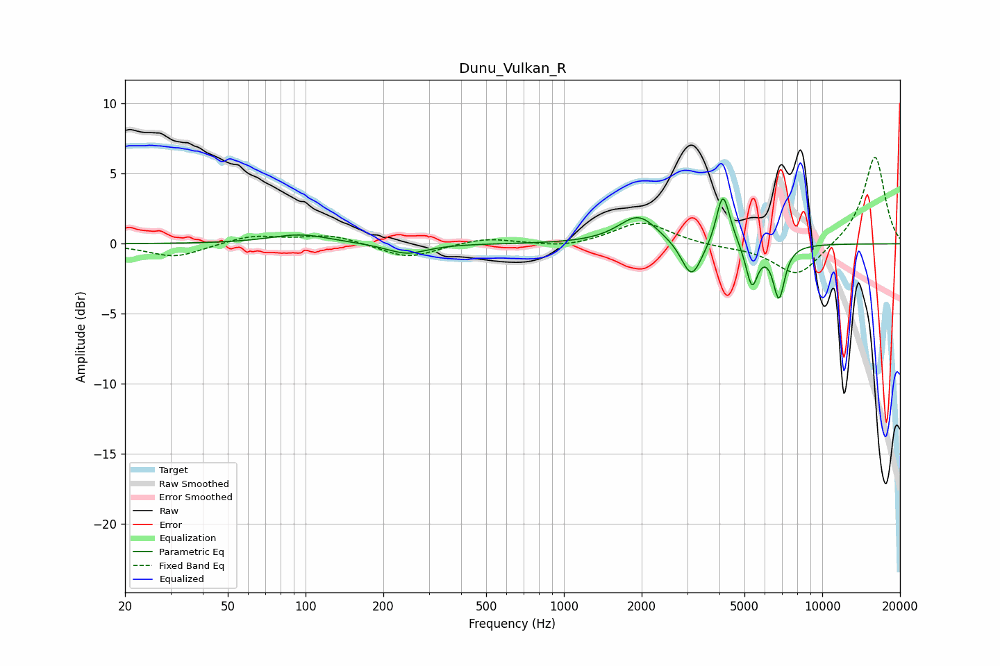

# Dunu_Vulkan_R
See [usage instructions](https://github.com/jaakkopasanen/AutoEq#usage) for more options and info.

### Parametric EQs
Apply preamp of -3.3 dB when using parametric equalizer.

|   # | Type    |   Fc (Hz) |    Q |   Gain (dB) |
|-----|---------|-----------|------|-------------|
|   1 | Peaking |        95 | 1.22 |         0.7 |
|   2 | Peaking |       246 | 1.82 |        -0.8 |
|   3 | Peaking |      1798 | 1.55 |         0.3 |
|   4 | Peaking |      1954 | 1.97 |         1.8 |
|   5 | Peaking |      3110 | 3.78 |        -2.2 |
|   6 | Peaking |      3204 | 3.06 |        -0.5 |
|   7 | Peaking |      4112 | 5.83 |         3.3 |
|   8 | Peaking |      4325 | 4.31 |         0.7 |
|   9 | Peaking |      5343 | 6    |        -3   |
|  10 | Peaking |      6799 | 5.99 |        -3.7 |

### Fixed Band EQs
When using fixed band (also called graphic) equalizer, apply preamp of **-6.3 dB** (if available) and set gains manually with these parameters.

|   # | Type    |   Fc (Hz) |    Q |   Gain (dB) |
|-----|---------|-----------|------|-------------|
|   1 | Peaking |        31 | 1.41 |        -1   |
|   2 | Peaking |        62 | 1.41 |         0.6 |
|   3 | Peaking |       125 | 1.41 |         0.6 |
|   4 | Peaking |       250 | 1.41 |        -1   |
|   5 | Peaking |       500 | 1.41 |         0.4 |
|   6 | Peaking |      1000 | 1.41 |        -0.3 |
|   7 | Peaking |      2000 | 1.41 |         1.6 |
|   8 | Peaking |      4000 | 1.41 |        -0.2 |
|   9 | Peaking |      8000 | 1.41 |        -2.4 |
|  10 | Peaking |     16000 | 1.41 |         6.3 |

### Graphs

