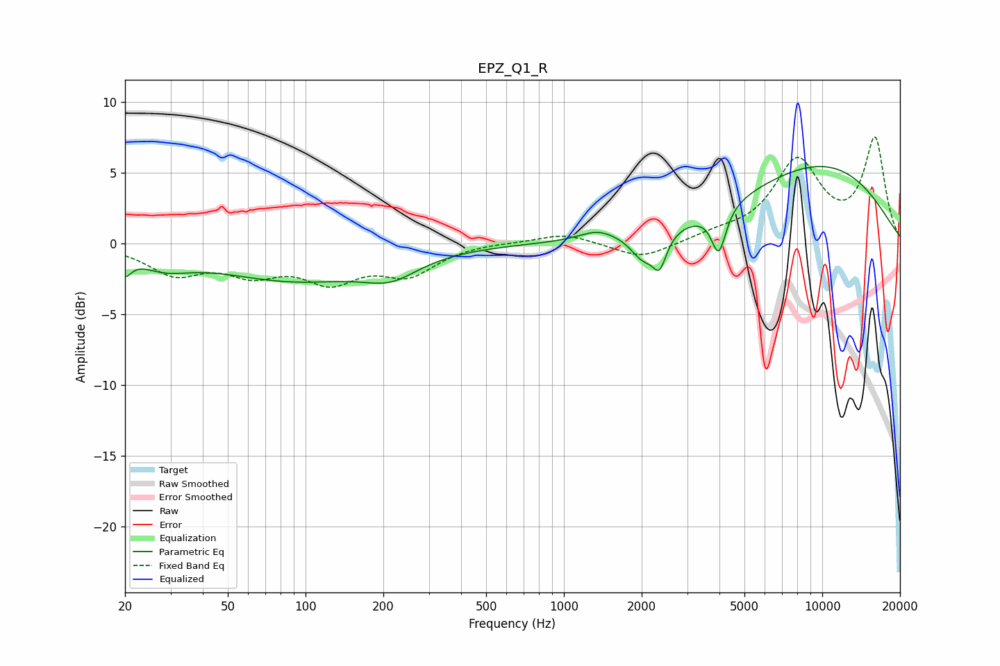

# EPZ_Q1_R
See [usage instructions](https://github.com/jaakkopasanen/AutoEq#usage) for more options and info.

### Parametric EQs
Apply preamp of -5.5 dB when using parametric equalizer.

|   # | Type    |   Fc (Hz) |    Q |   Gain (dB) |
|-----|---------|-----------|------|-------------|
|   1 | Peaking |        20 | 5.83 |        -1.3 |
|   2 | Peaking |        28 | 1.37 |        -1.1 |
|   3 | Peaking |        90 | 0.47 |        -2.5 |
|   4 | Peaking |       214 | 1.34 |        -1.4 |
|   5 | Peaking |      1350 | 2.03 |         0.7 |
|   6 | Peaking |      2021 | 3.01 |        -1.7 |
|   7 | Peaking |      2346 | 5.27 |        -2.2 |
|   8 | Peaking |      3469 | 4.77 |        -0   |
|   9 | Peaking |      3975 | 5.04 |        -3.2 |
|  10 | Peaking |      9735 | 0.39 |         5.5 |

### Fixed Band EQs
When using fixed band (also called graphic) equalizer, apply preamp of **-7.6 dB** (if available) and set gains manually with these parameters.

|   # | Type    |   Fc (Hz) |    Q |   Gain (dB) |
|-----|---------|-----------|------|-------------|
|   1 | Peaking |        31 | 1.41 |        -2   |
|   2 | Peaking |        62 | 1.41 |        -1.8 |
|   3 | Peaking |       125 | 1.41 |        -2.4 |
|   4 | Peaking |       250 | 1.41 |        -2   |
|   5 | Peaking |       500 | 1.41 |         0.1 |
|   6 | Peaking |      1000 | 1.41 |         0.7 |
|   7 | Peaking |      2000 | 1.41 |        -1.2 |
|   8 | Peaking |      4000 | 1.41 |         0.5 |
|   9 | Peaking |      8000 | 1.41 |         5.6 |
|  10 | Peaking |     16000 | 1.41 |         7.3 |

### Graphs

