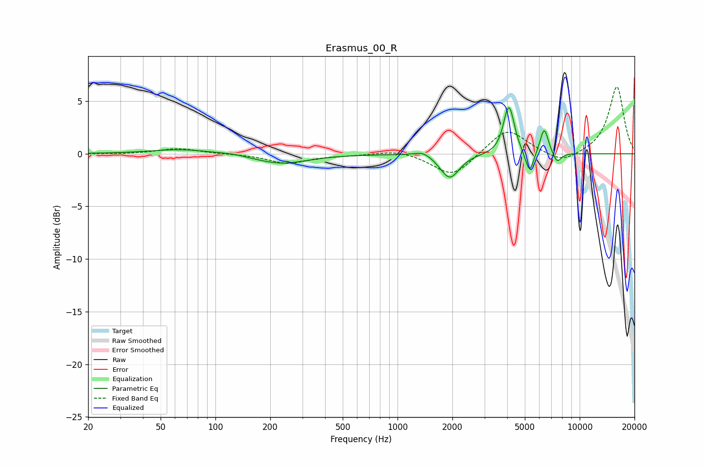

# Erasmus_00_R
See [usage instructions](https://github.com/jaakkopasanen/AutoEq#usage) for more options and info.

### Parametric EQs
Apply preamp of -4.5 dB when using parametric equalizer.

|   # | Type    |   Fc (Hz) |    Q |   Gain (dB) |
|-----|---------|-----------|------|-------------|
|   1 | Peaking |        65 | 0.88 |         0.4 |
|   2 | Peaking |       124 | 1.63 |         0.2 |
|   3 | Peaking |       228 | 0.95 |        -1   |
|   4 | Peaking |      1379 | 2.93 |         0.5 |
|   5 | Peaking |      1934 | 2.72 |        -2.4 |
|   6 | Peaking |      3976 | 5.98 |         0.9 |
|   7 | Peaking |      4117 | 4.89 |         3.8 |
|   8 | Peaking |      5308 | 6    |        -2.2 |
|   9 | Peaking |      6387 | 5.97 |         2.5 |
|  10 | Peaking |      7516 | 5.82 |        -1   |

### Fixed Band EQs
When using fixed band (also called graphic) equalizer, apply preamp of **-6.4 dB** (if available) and set gains manually with these parameters.

|   # | Type    |   Fc (Hz) |    Q |   Gain (dB) |
|-----|---------|-----------|------|-------------|
|   1 | Peaking |        31 | 1.41 |        -0   |
|   2 | Peaking |        62 | 1.41 |         0.5 |
|   3 | Peaking |       125 | 1.41 |        -0   |
|   4 | Peaking |       250 | 1.41 |        -0.9 |
|   5 | Peaking |       500 | 1.41 |        -0.1 |
|   6 | Peaking |      1000 | 1.41 |         0.4 |
|   7 | Peaking |      2000 | 1.41 |        -2.2 |
|   8 | Peaking |      4000 | 1.41 |         2.5 |
|   9 | Peaking |      8000 | 1.41 |        -1   |
|  10 | Peaking |     16000 | 1.41 |         6.4 |

### Graphs

