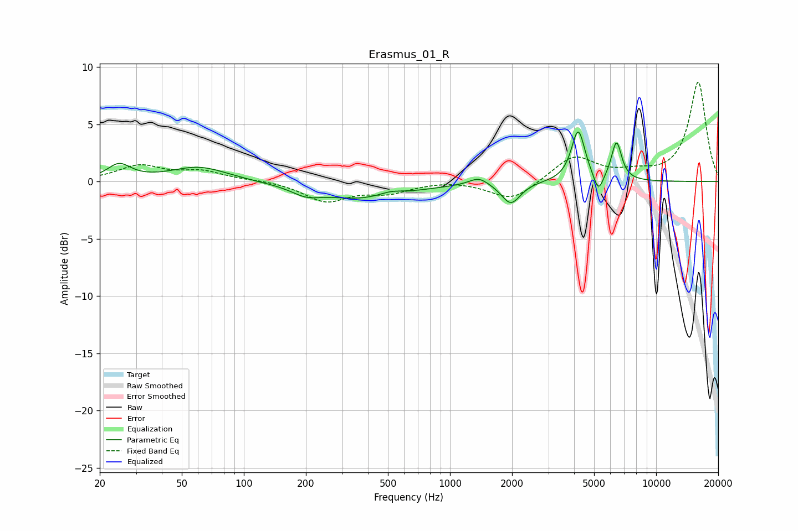

# Erasmus_01_R
See [usage instructions](https://github.com/jaakkopasanen/AutoEq#usage) for more options and info.

### Parametric EQs
Apply preamp of -4.4 dB when using parametric equalizer.

|   # | Type    |   Fc (Hz) |    Q |   Gain (dB) |
|-----|---------|-----------|------|-------------|
|   1 | Peaking |        25 | 2.53 |         1.4 |
|   2 | Peaking |        61 | 1.02 |         1.3 |
|   3 | Peaking |       200 | 2.05 |        -0.7 |
|   4 | Peaking |       385 | 0.65 |        -1.5 |
|   5 | Peaking |       514 | 2.19 |         0.4 |
|   6 | Peaking |      1380 | 3.01 |         0.7 |
|   7 | Peaking |      1974 | 3.1  |        -1.9 |
|   8 | Peaking |      4188 | 4.34 |         4.5 |
|   9 | Peaking |      5250 | 6    |        -1.7 |
|  10 | Peaking |      6423 | 5.58 |         3.4 |

### Fixed Band EQs
When using fixed band (also called graphic) equalizer, apply preamp of **-8.8 dB** (if available) and set gains manually with these parameters.

|   # | Type    |   Fc (Hz) |    Q |   Gain (dB) |
|-----|---------|-----------|------|-------------|
|   1 | Peaking |        31 | 1.41 |         1.3 |
|   2 | Peaking |        62 | 1.41 |         0.8 |
|   3 | Peaking |       125 | 1.41 |         0.1 |
|   4 | Peaking |       250 | 1.41 |        -1.7 |
|   5 | Peaking |       500 | 1.41 |        -0.9 |
|   6 | Peaking |      1000 | 1.41 |         0.2 |
|   7 | Peaking |      2000 | 1.41 |        -1.7 |
|   8 | Peaking |      4000 | 1.41 |         2.2 |
|   9 | Peaking |      8000 | 1.41 |         0.6 |
|  10 | Peaking |     16000 | 1.41 |         8.7 |

### Graphs

