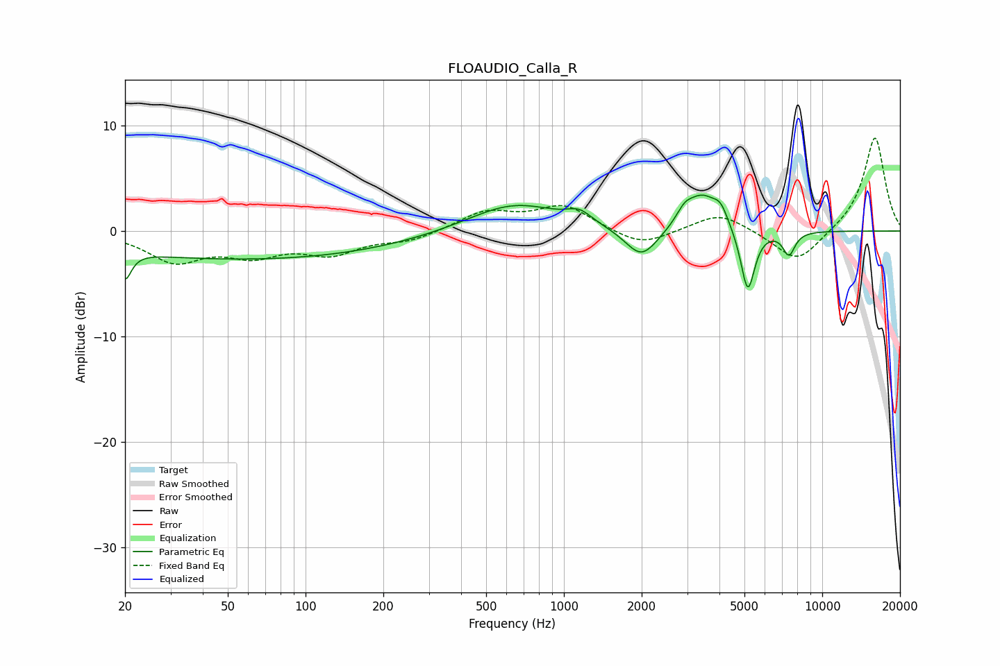

# FLOAUDIO_Calla_R
See [usage instructions](https://github.com/jaakkopasanen/AutoEq#usage) for more options and info.

### Parametric EQs
Apply preamp of -3.5 dB when using parametric equalizer.

|   # | Type    |   Fc (Hz) |    Q |   Gain (dB) |
|-----|---------|-----------|------|-------------|
|   1 | Peaking |        20 | 5.96 |        -2.6 |
|   2 | Peaking |        60 | 0.23 |        -2.7 |
|   3 | Peaking |       641 | 0.79 |         2.8 |
|   4 | Peaking |      1148 | 3    |         1   |
|   5 | Peaking |      1998 | 2.22 |        -3   |
|   6 | Peaking |      2930 | 4.3  |         1.2 |
|   7 | Peaking |      3437 | 2.29 |         3.2 |
|   8 | Peaking |      4046 | 4.89 |         1.4 |
|   9 | Peaking |      5149 | 5.12 |        -6.1 |
|  10 | Peaking |      7431 | 5.73 |        -2.2 |

### Fixed Band EQs
When using fixed band (also called graphic) equalizer, apply preamp of **-8.9 dB** (if available) and set gains manually with these parameters.

|   # | Type    |   Fc (Hz) |    Q |   Gain (dB) |
|-----|---------|-----------|------|-------------|
|   1 | Peaking |        31 | 1.41 |        -2.7 |
|   2 | Peaking |        62 | 1.41 |        -1.9 |
|   3 | Peaking |       125 | 1.41 |        -1.9 |
|   4 | Peaking |       250 | 1.41 |        -0.9 |
|   5 | Peaking |       500 | 1.41 |         1.8 |
|   6 | Peaking |      1000 | 1.41 |         2.3 |
|   7 | Peaking |      2000 | 1.41 |        -1.5 |
|   8 | Peaking |      4000 | 1.41 |         1.8 |
|   9 | Peaking |      8000 | 1.41 |        -3.1 |
|  10 | Peaking |     16000 | 1.41 |         9   |

### Graphs

