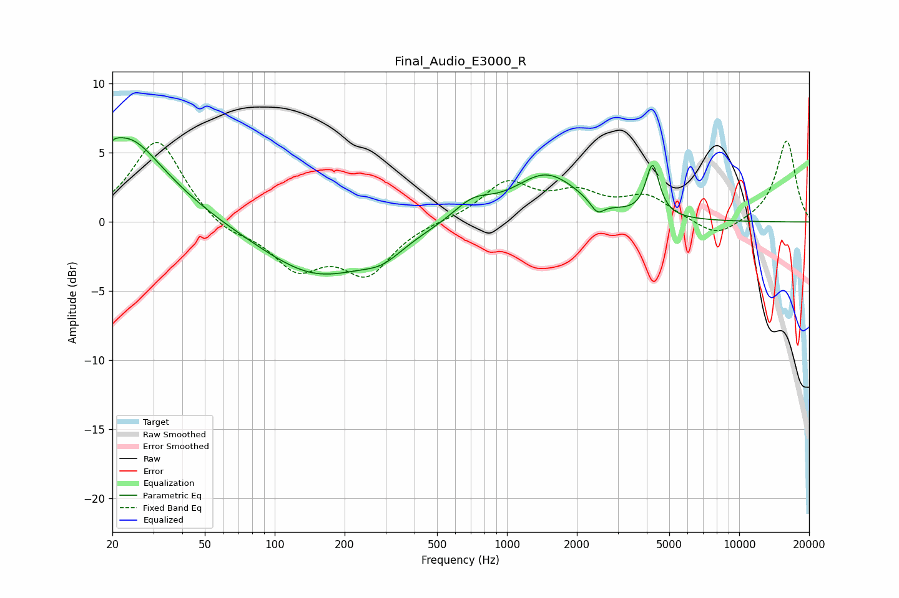

# Final_Audio_E3000_R
See [usage instructions](https://github.com/jaakkopasanen/AutoEq#usage) for more options and info.

### Parametric EQs
Apply preamp of -6.2 dB when using parametric equalizer.

|   # | Type    |   Fc (Hz) |    Q |   Gain (dB) |
|-----|---------|-----------|------|-------------|
|   1 | Peaking |        20 | 5.68 |         3.4 |
|   2 | Peaking |        21 | 5.96 |        -2.8 |
|   3 | Peaking |        24 | 1.57 |         1.4 |
|   4 | Peaking |        24 | 0.73 |         4.6 |
|   5 | Peaking |       153 | 0.59 |        -3.8 |
|   6 | Peaking |       291 | 1.62 |        -1.1 |
|   7 | Peaking |       710 | 1.67 |         1.4 |
|   8 | Peaking |      1478 | 1    |         3.4 |
|   9 | Peaking |      2449 | 4.83 |        -0.9 |
|  10 | Peaking |      4238 | 4.98 |         3.7 |

### Fixed Band EQs
When using fixed band (also called graphic) equalizer, apply preamp of **-6.0 dB** (if available) and set gains manually with these parameters.

|   # | Type    |   Fc (Hz) |    Q |   Gain (dB) |
|-----|---------|-----------|------|-------------|
|   1 | Peaking |        31 | 1.41 |         6   |
|   2 | Peaking |        62 | 1.41 |        -0.9 |
|   3 | Peaking |       125 | 1.41 |        -3.1 |
|   4 | Peaking |       250 | 1.41 |        -3.5 |
|   5 | Peaking |       500 | 1.41 |         0.1 |
|   6 | Peaking |      1000 | 1.41 |         2.7 |
|   7 | Peaking |      2000 | 1.41 |         1.8 |
|   8 | Peaking |      4000 | 1.41 |         1.7 |
|   9 | Peaking |      8000 | 1.41 |        -1.2 |
|  10 | Peaking |     16000 | 1.41 |         5.9 |

### Graphs

